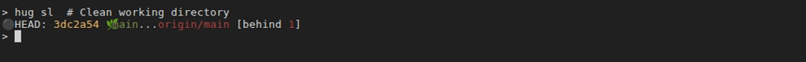
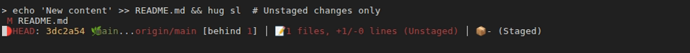
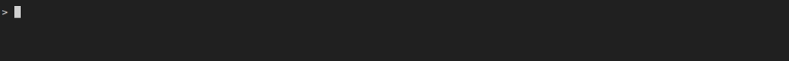
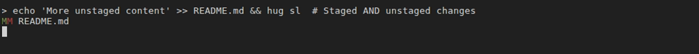

# VHS Screenshot System - Additional Improvements and Suggestions

This document outlines additional improvements and suggestions for the VHS screenshot system beyond the core implementation.

## Implemented Features ✅

### 1. Enhanced Build Script
- **vhs-build.sh**: Comprehensive build script with multiple options
  - Auto-discovery of all tape files
  - Dry-run mode
  - Parallel builds (optional)
  - Colored output and better error handling
  - Help documentation

### 2. Improved Makefile Targets
- `make vhs-check` - Verify VHS installation
- `make vhs` / `make vhs-build` - Build all screenshots
- `make vhs-build-one TAPE=filename.tape` - Build single tape
- `make vhs-dry-run` - Preview what would be built
- `make vhs-clean` - Remove generated images

### 3. Comprehensive Documentation
- **screencasts/README.md**: Complete guide for creating and managing tapes
- **template.tape**: Starting template for new tape files
- **VHS_CI_INTEGRATION.md**: CI/CD integration guide

### 4. New Tape Files
Created tape files for key commands:
- `hug-sl-states.tape` - Status in 4 different states
- `hug-lo.tape` - Log outgoing (quiet)
- `hug-l.tape` - Basic log with graph
- `hug-branch.tape` - Branch operations
- `hug-commit.tape` - Commit workflow
- `hug-working-dir.tape` - Working directory cleanup
- `hug-head.tape` - HEAD operations

### 5. Documentation Updates
- Updated `status-staging.md` with collapsible visual examples showing all 4 states

## Suggested Improvements 🚀

### 1. Pre-commit Hook for Screenshot Validation

Ensure tape files are valid before committing:

**Create `.git/hooks/pre-commit`:**
```bash
#!/bin/bash
# Validate VHS tape files before commit

if ! command -v vhs &> /dev/null; then
    echo "⚠️  VHS not installed, skipping tape validation"
    exit 0
fi

# Find modified tape files
MODIFIED_TAPES=$(git diff --cached --name-only --diff-filter=ACM | grep '\.tape$')

if [ -z "$MODIFIED_TAPES" ]; then
    exit 0
fi

echo "🎬 Validating modified VHS tape files..."

for tape in $MODIFIED_TAPES; do
    echo "  Checking $tape..."
    # Just check syntax, don't actually build
    if ! grep -q "^Output " "$tape"; then
        echo "❌ Error: $tape is missing Output directive"
        exit 1
    fi
done

echo "✅ All tape files validated"
```

**Add to Makefile:**
```makefile
install-hooks: ## Install git hooks for development
	@echo "Installing git hooks..."
	@cp scripts/pre-commit.sh .git/hooks/pre-commit
	@chmod +x .git/hooks/pre-commit
	@echo "✅ Git hooks installed"
```

### 2. Tape File Linter

Create a linter to check tape file quality:

**Create `docs/screencasts/bin/tape-lint.sh`:**
```bash
#!/bin/bash
# Lint VHS tape files for common issues

check_tape() {
    local tape=$1
    local errors=0
    
    # Check for Output directive
    if ! grep -q "^Output " "$tape"; then
        echo "  ❌ Missing Output directive"
        ((errors++))
    fi
    
    # Check for Require directives
    if ! grep -q "^Require hug" "$tape"; then
        echo "  ⚠️  Missing 'Require hug' directive"
    fi
    
    # Check for reasonable dimensions
    local width=$(grep "^Set Width" "$tape" | awk '{print $3}')
    if [ -n "$width" ] && [ "$width" -lt 800 ]; then
        echo "  ⚠️  Width might be too small: $width"
    fi
    
    # Check for demo-repo usage
    if ! grep -q "/tmp/demo-repo" "$tape"; then
        echo "  ⚠️  Not using demo-repo (/tmp/demo-repo)"
    fi
    
    # Check for cleanup
    if ! grep -q "Hide" "$tape" | tail -1; then
        echo "  ℹ️  Consider hiding cleanup commands at the end"
    fi
    
    return $errors
}

# Main
cd "$(dirname "$0")/.."
for tape in *.tape; do
    [ "$tape" = "template.tape" ] && continue
    echo "Checking $tape..."
    check_tape "$tape"
done
```

**Add to Makefile:**
```makefile
vhs-lint: ## Lint VHS tape files for quality issues
	@echo "$(BLUE)Linting VHS tape files...$(NC)"
	@bash docs/screencasts/bin/tape-lint.sh
```

### 3. Screenshot Comparison Tool

Detect visual changes in screenshots:

**Create `docs/screencasts/bin/compare-screenshots.sh`:**
```bash
#!/bin/bash
# Compare old and new screenshots to detect changes

if ! command -v compare &> /dev/null; then
    echo "ImageMagick 'compare' not found. Install: brew install imagemagick"
    exit 1
fi

OLD_DIR="$1"
NEW_DIR="${2:-docs/commands/img}"
DIFF_DIR="${3:-/tmp/screenshot-diffs}"

mkdir -p "$DIFF_DIR"

for new_img in "$NEW_DIR"/*.png "$NEW_DIR"/*.gif; do
    [ ! -f "$new_img" ] && continue
    
    basename=$(basename "$new_img")
    old_img="$OLD_DIR/$basename"
    
    if [ ! -f "$old_img" ]; then
        echo "➕ New: $basename"
        continue
    fi
    
    # Compare images
    if compare -metric AE "$old_img" "$new_img" "$DIFF_DIR/$basename" 2>/dev/null; then
        echo "✓ No change: $basename"
    else
        echo "⚠️  Changed: $basename (diff saved to $DIFF_DIR/$basename)"
    fi
done
```

**Usage:**
```bash
# Before regenerating
cp -r docs/commands/img /tmp/old-screenshots

# After regenerating
make vhs

# Compare
bash docs/screencasts/bin/compare-screenshots.sh /tmp/old-screenshots
```

### 4. Interactive Tape Generator

Create an interactive CLI tool to generate tape files:

**Create `docs/screencasts/bin/new-tape.sh`:**
```bash
#!/bin/bash
# Interactive tape file generator

echo "🎬 VHS Tape Generator"
echo ""

read -p "Command name (e.g., 'sl'): " cmd
read -p "Output type (gif/png): " type
read -p "Description: " desc
read -p "Height (default 600): " height
height=${height:-600}

tape_file="docs/screencasts/hug-${cmd}.tape"

if [ -f "$tape_file" ]; then
    read -p "⚠️  $tape_file exists. Overwrite? (y/N): " confirm
    [ "$confirm" != "y" ] && exit 1
fi

cat > "$tape_file" <<EOF
# VHS tape file for hug $cmd
# $desc

Output ../commands/img/hug-${cmd}.${type}

Require echo
Require hug

Set Shell "fish"
Set FontSize 13
Set Width 1020
Set Height $height
Set Margin 0
Set Padding 10
Set Theme "Afterglow"

# Setup
Hide
Type "cd /tmp/demo-repo" Enter
Sleep 500ms
Type "clear" Enter
Sleep 200ms
Show

# Demonstrate command
Set TypingSpeed 40ms
Type "hug $cmd  # $desc" Enter
Sleep 2s

# Cleanup
Hide
Type "hug w zap-all -f" Enter
Sleep 300ms
EOF

echo "✅ Created $tape_file"
echo ""
echo "Next steps:"
echo "  1. Edit $tape_file to add your command demonstration"
echo "  2. Build with: make vhs-build-one TAPE=hug-${cmd}.tape"
echo "  3. View output: docs/commands/img/hug-${cmd}.${type}"
```

**Add to Makefile:**
```makefile
vhs-new: ## Create a new VHS tape file interactively
	@bash docs/screencasts/bin/new-tape.sh
```

### 5. Screenshot Gallery Page

Create a gallery page showing all screenshots:

**Create `docs/screenshot-gallery.md`:**
```markdown
# Screenshot Gallery

This page shows all VHS-generated screenshots and GIFs used in the documentation.

## Status Commands

### hug sl - Status List

::: details Show all states




:::

## Logging Commands

### hug l - Log


### hug lo - Log Outgoing


### hug lol - Log Outgoing Long


<!-- ... more screenshots ... -->

## Command Workflows

### Branch Operations


### Commit Workflow


### Working Directory


### HEAD Operations

```

### 6. Automated Screenshot Validation in CI

Add a CI job to validate screenshots exist:

**Create `.github/workflows/validate-screenshots.yml`:**
```yaml
name: Validate Screenshots

on:
  pull_request:
    paths:
      - 'docs/**/*.md'
      - 'docs/commands/img/**'

jobs:
  validate:
    runs-on: ubuntu-latest
    steps:
      - uses: actions/checkout@v4
      
      - name: Check for missing screenshots
        run: |
          EXIT_CODE=0
          
          # Find all image references in markdown
          for md in docs/**/*.md; do
            grep -oP '!\[.*?\]\(img/\K[^)]+' "$md" | while read img; do
              img_path="$(dirname "$md")/img/$img"
              if [ ! -f "$img_path" ]; then
                echo "❌ Missing: $img_path (referenced in $md)"
                EXIT_CODE=1
              fi
            done
          done
          
          exit $EXIT_CODE
      
      - name: Check for unused screenshots
        run: |
          # Find screenshots not referenced in any markdown
          for img in docs/commands/img/*; do
            basename=$(basename "$img")
            if ! grep -r "$basename" docs/**/*.md >/dev/null; then
              echo "⚠️  Unused: $img"
            fi
          done
```

### 7. Performance Monitoring

Track screenshot generation time:

**Add to vhs-build.sh:**
```bash
# At the start of build_tape function
local start_time=$(date +%s)

# At the end
local end_time=$(date +%s)
local duration=$((end_time - start_time))
echo "  Built in ${duration}s"

# Track total time
TOTAL_TIME=$((TOTAL_TIME + duration))
```

### 8. Tape File Documentation Generator

Auto-generate documentation from tape files:

**Create `docs/screencasts/bin/generate-tape-docs.sh`:**
```bash
#!/bin/bash
# Generate markdown documentation from tape file comments

for tape in docs/screencasts/*.tape; do
    [ "$tape" = "*/template.tape" ] && continue
    
    echo "## $(basename "$tape" .tape)"
    echo ""
    
    # Extract description from comments
    grep "^# " "$tape" | head -5 | sed 's/^# //'
    echo ""
    
    # Extract output
    output=$(grep "^Output " "$tape" | head -1 | awk '{print $2}')
    echo "**Output:** $output"
    echo ""
done > docs/screencasts/TAPE_INDEX.md
```

### 9. Multi-shell Support

Support multiple shells in tape files:

**Update template.tape:**
```tape
# Detect and set appropriate shell
Set Shell "fish"  # or "zsh", "bash", "sh"

# Shell-specific prompt setup
Hide
Type 'export PS1="> "' Enter  # bash/zsh
# Type 'set -g fish_prompt_pwd_dir_length 0' Enter  # fish
Show
```

### 10. Accessibility Considerations

Add alt text and descriptions:

**Update documentation:**
```markdown

*Figure: Output of `hug sl` with a clean working directory*
```

## Priority Recommendations

**High Priority:**
1. ✅ Implement CI/CD integration (Option 3: Hybrid approach)
2. ✅ Create tape file template
3. 🔄 Add screenshot validation in CI
4. 🔄 Create pre-commit hook for tape validation

**Medium Priority:**
5. Create screenshot gallery page
6. Add tape file linter
7. Implement interactive tape generator
8. Add performance monitoring

**Low Priority:**
9. Create screenshot comparison tool
10. Add multi-shell support
11. Generate tape documentation automatically

## Implementation Notes

Most of these improvements are optional and can be added incrementally as the project evolves. The core system is functional and provides a solid foundation for automated screenshot generation.

The hybrid CI/CD approach (Option 3) is recommended as it provides the best balance of:
- Fast CI builds (using committed screenshots)
- Fresh documentation (via scheduled regeneration)
- Developer convenience (manual regeneration when needed)
