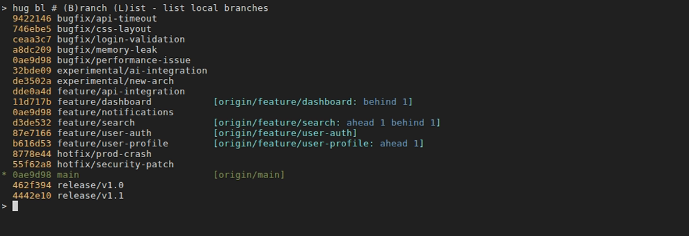
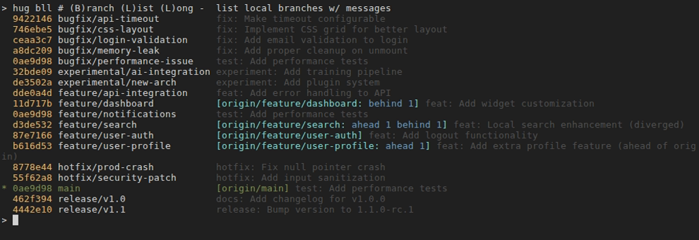

# Branching (b*)

Branching commands in Hug simplify managing local and remote branches. Prefixed with `b` for "branch", they provide intuitive ways to list, switch, create, delete, and query branches with safety checks and clear output.

These commands are implemented as Git aliases and scripts in the Hug tool suite, wrapping Git's branch operations for better usability, including interactive selection, color highlighting, and formatted views.

## Quick Reference

| Command | Memory Hook | Summary |
| --- | --- | --- |
| `hug b` | **B**ranch checkout | Switch to an existing branch or pick interactively |
| `hug bl` | **B**ranch **L**ist | List local branches |
| `hug bla` | **B**ranch **L**ist **A**ll | List local and remote branches |
| `hug blr` | **B**ranch **L**ist **R**emote | List remote branches only |
| `hug bll` | **B**ranch **L**ist **L**ong | Detailed local branch list with tracking info |
| `hug bc` | **B**ranch **C**reate | Create a new branch and switch to it |
| `hug br` | **B**ranch **R**ename | Rename the current branch |
| `hug brestore` | **B**ranch **RESTORE** | Restore a branch from a backup |
| `hug bdel` | **B**ranch **DEL**ete (safe) | Delete merged local branch |
| `hug bdelf` | **B**ranch **DEL**ete **F**orce | Force-delete local branch |
| `hug bdelr` | **B**ranch **DEL**ete **R**emote | Delete remote branch |
| `hug bpull` | **B**ranch **Pull** | Safe fast-forward pull (fails if merge/rebase needed) |
| `hug bpullr` | **B**ranch **Pull** **R**ebase | Pull with rebase (linear history) |
| `hug bwc` | **B**ranch **W**hich **C**ontain | Branches containing a commit |
| `hug bwp` | **B**ranch **W**hich **P**oint | Branches pointing at an object |
| `hug bwnc` | **B**ranch **W**hich **N**ot **C**ontain | Branches missing a commit |
| `hug bwm` | **B**ranch **W**hich **M**erged | Branches merged into a commit |
| `hug bwnm` | **B**ranch **W**hich **N**ot **M**erged | Branches not merged into a commit |

## Listing Branches

### `hug b [branch]`
- **Description**: Switch (checkout) to an existing local branch. If no branch is specified, shows an interactive menu of local branches for selection.
- **Example**:
  ```shell
  hug b main                 # Switch to main branch
  hug b                      # Interactive menu to select branch
  hug b feature/new-ui       # Switch to feature branch
  ```
- **Safety**: Interactive mode prevents accidental switches. Always checks if you're in a Git repo.

### `hug bl`
- **Description**: List local branches in short format, sorted alphabetically. The current branch is marked with an asterisk (*).
- **Example**:
  ```shell
  hug bl    # List all local branches
  ```
- **Safety**: Read-only operation; no changes to repo state.
- 

### `hug bla`
- **Description**: List all branches (local and remote) in short format.
- **Example**:
  ```shell
  hug bla   # List all branches including remotes
  ```
- **Safety**: Read-only.
- 

### `hug blr`
- **Description**: List remote branches only in short format.
- **Example**:
  ```shell
  hug blr   # List remote branches
  ```
- **Safety**: Read-only.
- 

### `hug bll`
- **Description**: List local branches in long format with details: short commit hash, upstream tracking info (e.g., ahead/behind counts), and the latest commit message title. Current branch is highlighted in green and marked with *. Branches are left-aligned for readability.
- **Example**:
  ```shell
  hug bll   # Detailed local branch listing
  ```
- **Safety**: Read-only; displays tracking info like `git branch -vv` but with commit subjects.
- 

## Branch Creation / Modification

### `hug bc <branch-name>`
- **Description**: Create a new branch and switch to it.
- **Example**:
  ```shell
  hug bc new-feature    # Create and switch to new-feature
  ```
- **Safety**: Non-destructive; creates from current HEAD.

### `hug br <new-name>`
- **Description**: Rename the current branch to a new name.
- **Example**:
  ```shell
  hug br updated-feature  # Rename current branch
  ```
- **Safety**: Prompts for confirmation if the new name exists.

### `hug brestore [<backup-branch>] [<target-branch>]`
- **Description**: Restore a branch from a backup created by commands like `hug rb`. Backups follow the naming convention `hug-backups/YYYY-MM/DD-HHMM.original-name`. If no arguments are provided, shows an interactive menu of available backups. When there are 10 or more backup branches and [gum](https://github.com/charmbracelet/gum) is installed, uses an interactive filter for easier selection. Otherwise, displays a numbered list. If only the backup branch is specified, restores to the original branch name. If both arguments are provided, restores to a different branch name.
- **Examples**:
  ```shell
  hug brestore                                      # Interactive: select from available backups (uses gum filter for 10+)
  hug brestore hug-backups/2025-11/02-1234.feature # Restore to 'feature'
  hug brestore hug-backups/2025-11/02-1234.feature recovered-feature  # Restore to 'recovered-feature'
  hug brestore hug-backups/2025-11/02-1234.feature --dry-run  # Preview restoration
  ```
- **Safety**: Prompts for confirmation if the target branch already exists (destructive operation). Use `--dry-run` to preview changes. The original backup branch is preserved after restoration.

## Branch Deletion

### `hug bdel <branch>`
- **Description**: Safely delete a local branch (only if fully merged into current branch).
- **Example**:
  ```shell
  hug bdel old-feature    # Safe delete if merged
  ```
- **Safety**: Fails if unmerged; requires confirmation.

### `hug bdelf <branch>`
- **Description**: Force-delete a local branch, even if unmerged.
- **Example**:
  ```shell
  hug bdelf risky-branch  # Force delete unmerged branch
  ```
- **Safety**: Double-prompts for confirmation to prevent accidents.

### `hug bdelr <branch>`
- **Description**: Delete a remote branch from the `origin` remote.
- **Example**:
  ```shell
  # First, list remote branches to find the one to delete
  hug blr
  # Then, delete the desired branch by name
  hug bdelr old-remote-feature
  ```
- **Safety**: Prompts for confirmation before deleting.

## Pulling Branches

Hug provides safe, intuitive pull commands under the `b*` prefix, emphasizing fast-forward safety by default while offering rebase for linear histories.

### `hug bpull`
- **Description**: Safe fast-forward pull from upstream. Succeeds only if your local branch can fast-forward (no local divergence); aborts otherwise to prevent unintended merges or rewrites. Ideal for verifying sync before critical operations like tagging or releasing.
- **Example**:
  ```shell
  hug bpull    # Pull if fast-forward possible; fails safely if diverged
  ```
- **Safety**: Ultra-safe - aborts on any need for merge/rebase, prompting you to inspect with `hug sl` or use `hug bpullr`.

### `hug bpullr`
- **Description**: Pull with rebase, replaying your local commits on top of remote changes for a clean, linear history. Use when you've diverged locally (e.g., after committing features).
- **Example**:
  ```shell
  hug bpullr   # Pull and rebase for linear history
  ```
- **Safety**: Non-destructive to remote history, but may require conflict resolution. Aborts on issues; resume with `hug rbc` or abort with `hug rba`. See the [Rebase Conflict Workflow](rebase.md#rebase-conflict-workflow) for a detailed guide on resolving conflicts.

## Branch Queries (bw*)

These commands help inspect which branches relate to specific commits or states.

### `hug bwc [<commit>]`
- **Description**: Show branches that contain a specific commit (in their history). Defaults to HEAD.
- **Example**:
  ```shell
  hug bwc a1b2c3    # Branches containing commit a1b2c3
  hug bwc           # Branches containing HEAD
  ```
- **Safety**: Read-only.
- 

### `hug bwp [<object>]`
- **Description**: Show branches that point exactly at a specific object (e.g., commit). Defaults to HEAD.
- **Example**:
  ```shell
  hug bwp HEAD       # Branches pointing at HEAD
  ```
- **Safety**: Read-only.
- 

### `hug bwnc [<commit>]`
- **Description**: Show branches that do NOT contain a specific commit. Defaults to HEAD.
- **Example**:
  ```shell
  hug bwnc HEAD      # Branches not containing HEAD
  ```
- **Safety**: Read-only.
- 

### `hug bwm [<commit>]`
- **Description**: Show branches merged into a specific commit (defaults to HEAD).
- **Example**:
  ```shell
  hug bwm            # Branches merged into HEAD
  ```
- **Safety**: Read-only.
- 

### `hug bwnm [<commit>]`
- **Description**: Show branches NOT merged into a specific commit (defaults to HEAD).
- **Example**:
  ```shell
  hug bwnm           # Branches not merged into HEAD
  ```
- **Safety**: Read-only.
- 

## Tips
- Use `hug b` to review branch status and easily switch via an interactive menu.
- For creating a branch from an existing one: `hug bc <new> <existing>` (e.g., `hug bc new-feature existing-feature`).
- Use `hug blr` to list remote branches before deleting one with `hug bdelr`.
- Queries like `bwc` and `bwm` are useful for cleanup before `bdel`.
- Commands like `hug rb` automatically create backup branches in the `hug-backups/` namespace. Use `hug brestore` to restore them if needed.
- Backup branches follow the naming convention `hug-backups/YYYY-MM/DD-HHMM.original-name`, making them easy to identify and clean up.

See [Status & Staging](status-staging) for checking changes after branching operations.
