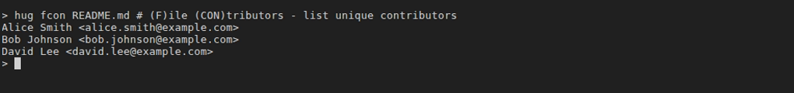

# File Inspection (f*)
File inspection commands in Hug help you analyze the history and authorship of specific files. Prefixed with `f` for "file," they provide tools for blame (who
changed what), contributor lists, author commit counts, and finding when a file was first added. These are especially useful for understanding code ownership
and evolution over time.

When no file is provided, these commands will show an interactive file selection UI (requires [gum](https://github.com/charmbracelet/gum) to be installed).
This makes it easy to explore files without memorizing paths.

## Quick Reference

| Command | Memory Hook | Summary |
| --- | --- | --- |
| `hug fblame` | **F**ile **B**lame | Detailed blame with movement detection |
| `hug fb` | **F**ile **B**lame (porcelain) | Lightweight blame output for scripting |
| `hug fcon` | **F**ile **CON**tributors | List unique contributors to a file |
| `hug fa` | **F**ile **A**uthors | Count commits per author for a file |
| `hug fborn` | **F**ile **B**orn | Show the commit where the file was added |

## Blame Commands
Blame shows which author last modified each line of a file, helping attribute changes.
- `hug fblame [<file>]`
    - **Description**: Detailed blame showing author, date, and line content for each line in the file. Ignores whitespace changes and detects moved/copied code
      across files (up to 3 levels). When no file is provided, shows interactive file selection UI.
    - **Example**:
      ```shell
      hug fblame               # Interactive file selection
      hug fblame src/app.js    # Blame for app.js
      ```
    - **Safety**: Read-only; no repo changes.
    - **Git Equivalent**: `git blame -w -C -C -C <file>`
    - 
- `hug fb [<file>]`
    - **Description**: Short blame output with just author and line number (porcelain format for scripting). When no file is provided, shows interactive file selection UI.
    - **Example**:
      ```shell
      hug fb                   # Interactive file selection
      hug fb README.md         # Short blame for README.md
      ```
    - **Safety**: Read-only.
    - **Git Equivalent**: `git blame -w -C -C -C --line-porcelain <file>`

## Contributor Analysis
- `hug fcon [<file>]`
    - **Description**: List all unique contributors (authors with email) to a file, following renames. When no file is provided, shows interactive file selection UI.
    - **Example**:
      ```shell
      hug fcon                 # Interactive file selection
      hug fcon docs/index.md   # Contributors to index.md
      ```
    - **Safety**: Read-only.
    - **Git Equivalent**: `git log --follow --pretty=format:'%an <%ae>' -- <file> | sort -u`
    - 
- `hug fa [<file>]`
    - **Description**: Count commits per author for a file (sorted by count descending), following renames. When no file is provided, shows interactive file selection UI.
    - **Example**:
      ```shell
      hug fa                   # Interactive file selection
      hug fa lib/utils.js      # Author commit counts for utils.js
      ```
    - **Safety**: Read-only.
    - **Git Equivalent**: `git log --follow --format='%an' -- <file> | sort | uniq -c | sort -rn`
    - 

## File Origin
- `hug fborn [<file>]`
    - **Description**: Show the commit where the file was first added (born), including the full commit details and message. Handles renames with a 40%
      similarity threshold. When no file is provided, shows interactive file selection UI.
    - **Usage**:
      ```shell
      hug fborn                # Interactive file selection
      hug fborn package.json   # When package.json was added
      ```
    - **Safety**: Read-only.
    - **Git Equivalent**: `git log --pretty=logbody --follow --diff-filter=A --find-renames=40% -- <file>`
    - 

## Tips
- Combine with [Logging](logging#file-inspection) for broader file history: e.g., use `hug llf <file> -1` for the latest commit, then `hug fblame <file>` to see line authors.
- For detecting code movement across files, `fblame` and `fb` use advanced `-C -C -C` options - great for refactors.
- Pipe outputs to tools: `hug fa <file> | head -5` for top 5 contributors.
- Always use `--follow` implicitly for rename-aware inspection.

Pair with [Status & Staging](status-staging) to inspect current file changes, or [Logging](logging) for commit-level details.
