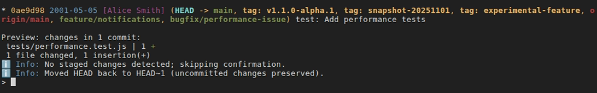
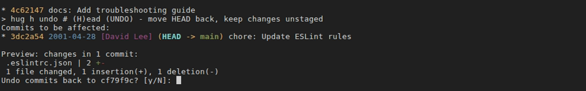
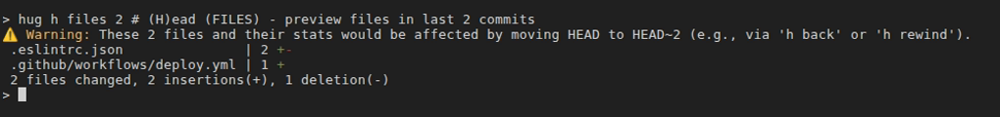

# HEAD Operations (h *)

HEAD operations in Hug allow you to safely move or undo commits without losing work. Commands are accessed via the main `h` command (for "HEAD") and follow a progressive destructiveness: `back` (safest) to `rewind` (most destructive). Use `hug h files` to preview affected files before any operation.

These commands provide intuitive names and built-in safeguards for moving the branch pointer (HEAD), avoiding the complexity of Git's `reset` modes.

## Quick Reference

| Command              | Memory Hook | Summary                                                                           |
|----------------------| --- |-----------------------------------------------------------------------------------|
| `hug h back [-u      |-t TIME] [--force]` | **H**EAD **Back** | HEAD goes back, keeping changes staged                                            |
| `hug h undo [-u      |-t TIME] [--force]` | **H**EAD **Undo** | HEAD goes back, keeping changes unstaged                                          |
| `hug h rollback [-u  |-t TIME] [--force]` | **H**EAD **R**ollback | HEAD goes back, discarding changes but preserving uncommitted changes             |
| `hug h rewind [-u    |-t TIME] [--force]` | **H**EAD **Re**wind | HEAD goes back, discarding ALL changes, including uncommitted ones                |
| `hug h squash [-u    |-t TIME] [-i|-e|-m] [--force]` | **H**EAD **S**quash | HEAD goes back + commit last N/local/specific commits as 1 (default: concatenated messages; -i: initial message; -m: custom message; -e: edit) |
| `hug h files [-u     |-t TIME] [-p|--patch [FILE]]` | **H**EAD **F**iles | Preview files touched in the selected range (or local-only with -u, or by time with -t); optionally show patch (-p) before stats |
| `hug h steps <file>` | **H**EAD **Steps** | Count steps back to find most recent file change (query for rewinds)              |

## Upstream Safety Workflow (`-u` / `--upstream`)
Several HEAD commands (`hug h back`, `hug h rollback`, `hug h undo`, `hug h rewind`, `hug h squash`) share a read-only preview/confirmation helper when you pass `-u`/`--upstream`. It lists the commits above the upstream tip and shows their file change statistics before any reset happens, letting you cancel with zero repository changes. Use `--force` to skip the confirmation. `hug h files -u` uses the same preview data while staying read-only.
> Developer note: the shared helper (`handle_upstream_operation`) inspects history only—it never modifies commits, the index, or the working tree.

## Temporal Filtering (`-t` / `--temporal`)
All HEAD movement commands (`hug h back`, `hug h undo`, `hug h rollback`, `hug h rewind`, `hug h squash`, `hug h files`) support the `-t`/`--temporal TIME` flag to specify commits by time instead of count or commit reference. TIME can be relative (e.g., "3 days ago", "1 week ago") or absolute (e.g., "2024-01-15", "2024-01-15 10:30"). The reference point is HEAD's commit time. This allows you to work with commits based on when they were made rather than their position in history. Cannot be combined with `-u`/`--upstream` or explicit targets (N|COMMIT).

## Commands

### `hug h back [N|commit] [-u, --upstream] [-t, --temporal TIME] [--force]`
- **Description**: HEAD goes back by N commits (default: 1) or to a specific commit. Keeps changes from the undone commits staged - non-destructive, ideal for re-committing with adjustments. With `-u`, resets to upstream remote tip (e.g., origin/my-branch), discarding local-only commits (no fetch needed). With `-t/--temporal`, moves HEAD to the first commit at or after the specified time.
- **Example**:
  ```shell
  hug h back                # Undo last commit, keep changes staged
  hug h back 3              # Undo last 3 commits
  hug h back a1b2c3         # HEAD goes back to specific commit
  hug h back -u             # HEAD goes back to upstream tip, keep local changes staged
  hug h back 3 --force      # Skip confirmation
  hug h back -t "3 days ago"    # Move HEAD to first commit from 3 days ago
  hug h back -t "1 week ago"    # Move HEAD to first commit from 1 week ago
  hug h back -t "2024-01-15"    # Move HEAD to first commit on or after Jan 15, 2024
  ```
- **Safety**: Non-destructive; changes remain staged and can be inspected with `hug sl` (**S**tatus + **L**ist uncommitted files) and `hug ss` (**S**tatus + **S**taged diff) or re-committed. Previews commits and their file change statistics and requires y/n confirmation when staged changes are present (skipped with --force or when the staging area is clean); the preview helper is read-only, so no reset happens until you confirm. Cannot mix `-u` with explicit target or `-t`. Cannot mix `-t` with explicit target.
- 

### `hug h undo [N|commit] [-u, --upstream] [-t, --temporal TIME] [--force]`
- **Description**: HEAD goes back by N commits (default: 1) or to a specific commit. Unstages changes from the undone commits but keeps them in your working directory - perfect for editing before re-staging. With `-u`, resets to upstream remote tip, discarding local-only commits. With `-t/--temporal`, moves HEAD to the first commit at or after the specified time.
- **Example**:
  ```shell
  hug h undo                # Undo last commit, unstage changes
  hug h undo 3              # Undo last 3 commits
  hug h undo main           # Undo to main branch
  hug h undo -u             # Undo to upstream tip, keep local changes unstaged
  hug h undo 3 --force      # Skip confirmation
  hug h undo -t "3 days ago"    # Move HEAD to first commit from 3 days ago
  hug h undo -t "1 week ago"    # Move HEAD to first commit from 1 week ago
  ```
- **Safety**: Non-destructive; changes remain in working directory and can be viewed with `hug su` (**S**tatus + **U**nstaged diff). Previews commits and their file change statistics and requires y/n confirmation when staged or unstaged changes are present (skipped with --force or when both the staging area and working tree are clean). Keeps protection when staged or unstaged work might be unintentionally merged into the undo, but skips the prompt when no staged or unstaged changes are present. The preview helper is read-only, so no reset happens until you confirm. Cannot mix `-u` with explicit target or `-t`. Cannot mix `-t` with explicit target.
- 

### `hug h rollback [N|commit] [-u, --upstream] [-t, --temporal TIME] [--force]`
- **Description**: HEAD goes back by N commits (default: 1) or to a specific commit, discarding commit history and staged changes, but preserving any uncommitted local changes in the working directory. With `-u`, resets to upstream remote tip, discarding local-only commits but keeping uncommitted work. With `-t/--temporal`, moves HEAD to the first commit at or after the specified time.
- **Example**:
  ```shell
  hug h rollback            # Rollback last commit, keep local work
  hug h rollback 2          # Rollback last 2 commits
  hug h rollback a1b2c3     # Rollback to specific commit
  hug h rollback -u         # Rollback to upstream tip, preserve local uncommitted changes
  hug h rollback 2 --force  # Skip confirmation
  hug h rollback -t "3 days ago"   # Rollback to first commit from 3 days ago
  hug h rollback -t "1 week ago"   # Rollback to first commit from 1 week ago
  ```
- **Safety**: Aborts if it would overwrite uncommitted changes. Previews commits and their file change statistics and requires y/n confirmation (skipped with --force); the preview helper is read-only, so no reset happens until you confirm. Cannot mix `-u` with explicit target or `-t`. Cannot mix `-t` with explicit target. Use `hug h files` first to inspect.

### `hug h rewind [N|commit] [-u, --upstream] [-t, --temporal TIME] [--force]`
- **Description**: HEAD goes back by N commits (default: 1) or to a specific commit, moving to a clean state. Highly destructive! Discards all staged/unstaged changes in tracked files (untracked/ignored files are preserved). With `-u`, resets to upstream remote tip, discarding everything after it. With `-t/--temporal`, moves HEAD to the first commit at or after the specified time.
- **Example**:
  ```shell
  hug h rewind              # Rewind to last commit's clean state
  hug h rewind 3            # Rewind last 3 commits
  hug h rewind origin/main  # Rewind to remote main
  hug h rewind -u           # Rewind to upstream tip
  hug h rewind 3 --force    # Skip confirmation (very dangerous!)
  hug h rewind -t "3 days ago"   # Rewind to first commit from 3 days ago
  hug h rewind -t "1 week ago"   # Rewind to first commit from 1 week ago
  ```
- **Safety**: Previews commits and their file change statistics to be discarded, requires typing "rewind" to confirm (skipped with --force). The preview helper is read-only; nothing changes until you confirm. Even if HEAD is already at the target, the command still hard-resets tracked changes in the index and working tree. Untracked files are safe. Cannot mix `-u` with explicit target or `-t`. Cannot mix `-t` with explicit target.

### `hug h squash [N|commit] [-u, --upstream] [-t, --temporal TIME] [-i|--initial-message] [-m|--message MSG] [-e|--edit] [--force]`
- **Description**: Moves HEAD back by N commits (default: 2) or to a specific commit (like `h back`), then immediately commits the staged changes as one new commit. By default, combines all commit messages from squashed commits. Message behavior can be controlled with flags:
  - **Default**: Concatenates all commit messages with `[squash] N commits…` prefix
  - `-i/--initial-message`: Uses the first (oldest) squashed commit's full message (subject + body + footers) instead of concatenation
  - `-m/--message MSG`: Uses the provided message directly (conflicts with `-e` and `-i`)
  - `-e/--edit`: Opens editor to edit the commit message (pre-populated with initial message if `-i` is also used)

  Changes from all squashed commits are kept staged so that they can be committed in sequence. With `-u`, squashes local-only commits onto the upstream tip. With `-t/--temporal`, squashes commits from the first commit at or after the specified time to HEAD. Non-destructive to uncommitted working directory changes.
- **Example**:
  ```shell
  hug h squash                       # Squash last 2 commits into 1 (concatenated messages)
  hug h squash 3                     # Squash last 3 commits into 1
  hug h squash 3 -i                  # Squash with first (oldest) squashed commit's full message
  hug h squash 3 -m "feat: xyz"      # Squash with custom message
  hug h squash 3 -e                  # Squash and open editor for message
  hug h squash 3 -i -e               # Edit initial commit message in editor
  hug h squash a1b2c3                # Keep a1b2c3 unchanged; Squash all commits above it into 1
  hug h squash -u                    # Keep upstream tip unchanged; Squash local-only commits on top
  hug h squash 3 --force             # Skip confirmation
  hug h squash -t "3 days ago"       # Squash commits from 3 days ago to HEAD
  hug h squash -t "1 week ago" -i    # Squash commits from 1 week ago with initial commit message
  ```
- **Safety**: Previews commits and their file change statistics affected and requires y/n confirmation when staged changes are present (skipped with --force or when the staging area is clean). Keeps protection when staged work might be unintentionally lumped into the squash, but skips the prompt when no staged changes are present. The shared preview helper is read-only; the squash only runs after you confirm. Aborts if no upstream set for `-u` or invalid target. If no staged changes after reset, skips commit and warns. Cannot mix `-u` with explicit target or `-t`. Cannot mix `-t` with explicit target. Cannot use `-m` with `-e` or `-i` (conflicting message options).
- Pre-existing staged changes will be included - review with `hug ss` first.

### `hug h files [N|commit] [options]`
- **Description**: Preview unique files touched by commits in the specified range (default: last 1 commit), including line change stats. Optionally show full patch of changes (-p/--patch) or patch for a specific file (--patch=FILE) before the stats. Use -- with -p to interactively select a specific file for the patch instead of showing the full patch. With `-u`, previews files and stats in local-only commits (HEAD to upstream tip). With `-t/--temporal`, filters commits by time relative to HEAD's commit time. Useful before back, undo, rollback, or rewind to understand impact.
- **Options**:
  - `-u, --upstream`: Use upstream remote tip as start point (local-only commits)
  - `-t, --temporal TIME`: Specify commits by time instead of count/commit. TIME can be relative (e.g., "3 days ago", "1 week ago") or absolute (e.g., "2024-01-15"). Reference point is HEAD's commit time.
  - `-p, --patch`: Show full patch of changes before stats
  - `--patch=FILE`: Show patch for specific FILE before stats
  - `--`: Trigger interactive file selection for patch (with -p)
- **Example**:
  ```shell
  hug h files                # Files and stats in last commit
  hug h files 3              # Files and stats in last 3 commits
  hug h files main           # Files and stats changed since main
  hug h files -u             # Files and stats in local-only commits to upstream
  hug h files 3 -p           # Full patch and stats in last 3 commits
  hug h files 3 -p --        # Interactively select file for patch and stats in last 3 commits
  hug h files main --patch=src/main.py  # Patch for src/main.py and stats changed after 'main' to HEAD
  hug h files -t "3 days ago"    # Files changed in last 3 days (relative to HEAD's time)
  hug h files -t "1 week ago"    # Files changed in last week
  hug h files -t "2024-01-15"    # Files changed since Jan 15, 2024
  hug h files -t "3 days ago" -p # Show patch and stats for files changed in last 3 days
  ```
- **Safety**: Read-only; no changes to repo. Upstream mode uses the shared preview data but remains read-only. Cannot mix `-u` with explicit target or `-t/--temporal`. Cannot mix `-t/--temporal` with explicit target.
- 

### `hug h steps [<file>] [--raw]`
- **Description**: Calculate how many commit steps from HEAD back to the most recent commit touching `file` (handles renames). Outputs the count; use for precise rewinds like `h back N`. Full mode shows formatted commit info via `hug ll`. When no file is provided, shows interactive file selection UI (requires gum).
- **Example**:
  ```shell
  hug h steps                     # Interactive file selection
  hug h steps src/app.js          # "3 steps back from HEAD (last commit abc123); <ll output>"
  hug h steps README.md --raw     # "3" (just the number)
  hug h steps file.txt | xargs hug h back  # Rewind exactly to last change
  ```
- **Safety**: Read-only query; errors if file has no history. If 0 steps, confirms last change is in HEAD.

## Tips
- Preview impact with `hug h files` (or `hug h files -u` for local-only, or `hug h files -t "3 days ago"` for time-based) before any HEAD movement (e.g., `hug h files 2` then `hug h back 2`).
- Preview cumulative file changes before squashing: `hug shc HEAD~3..HEAD` shows all files that would be affected by squashing the last 3 commits.
- Sync to remote after local dev: `hug h squash -u` (all local-only commits squashed into 1), `hug h undo -u` (unstaged) etc.
- Work with time-based ranges: `hug h back -t "1 week ago"` (move HEAD to a week ago), `hug h squash -t "3 days ago"` (squash last 3 days of work).
- For quick squashing: `hug h squash N` (HEAD goes back + auto-commit with top-most message).
- Use `--force` for non-interactive scripting (skips confirmations but prints other messages; combine with `--quiet` for minimal output).
- Use [`hug sl` or `hug sw` (**S**tatus + **W**orking directory diff)](status-staging.md#quick-reference) to check status after any HEAD movement.
- For interactive history editing (edit/squash multiple commits), see [Rebase Commands](rebase.md).
- Aliases like `hug back` are available as shortcuts for `hug h back`.

Pair with [Working Directory](working-dir.md) for cleanup/restore, or [Logging](logging.md) to inspect history before resetting.
