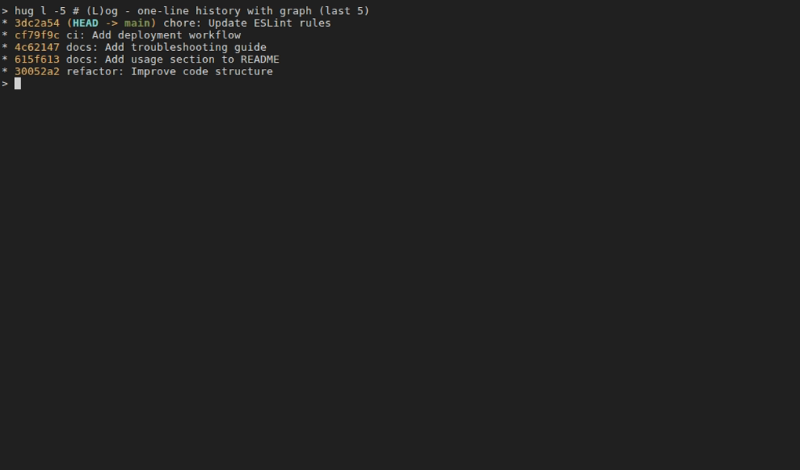
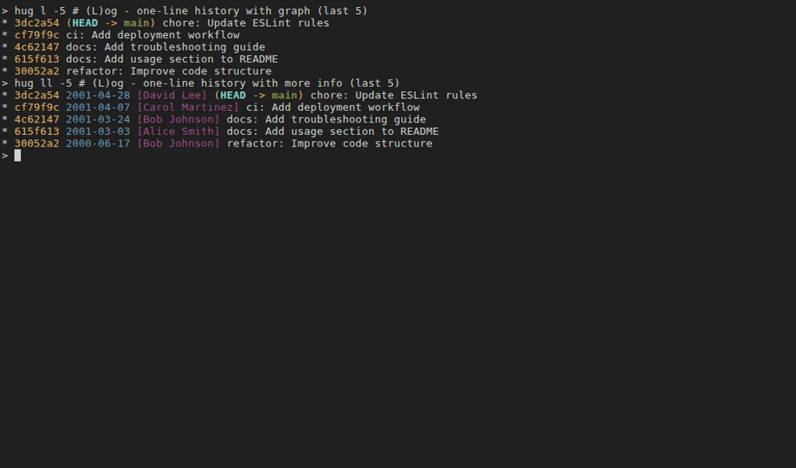
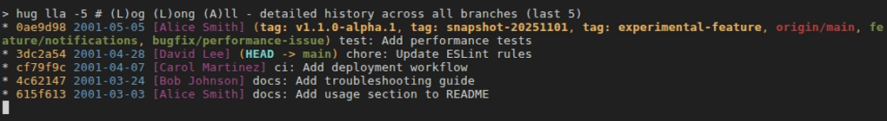
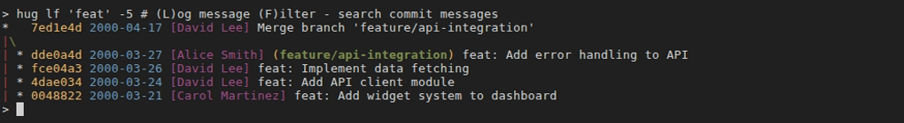
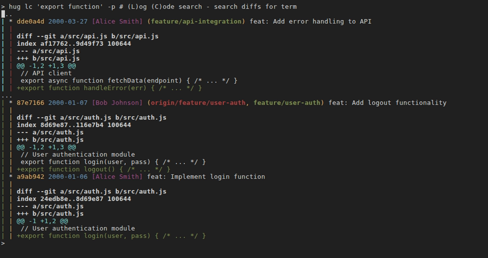
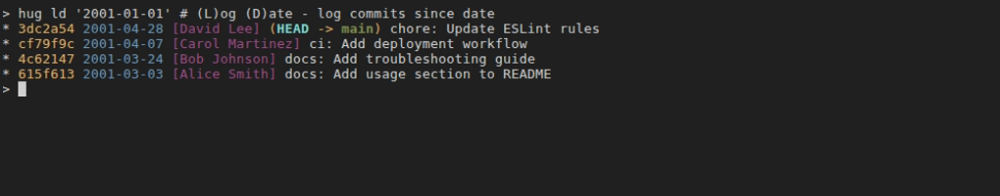
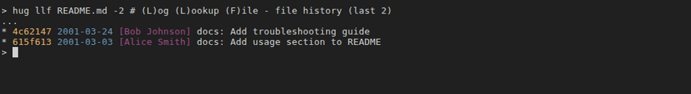

# Logging (l*)

Logging commands in Hug provide powerful ways to view, search, and inspect commit history. Prefixed with `l` for "log," they enhance Git's `log` command with intuitive searches by message, code changes, authors, dates, and file-specific histories. File-focused commands (llf*) handle renames via `--follow` and support limiting to recent commits (e.g., `-1` for the most recent).

## Quick Reference

| Command    | Memory Hook                           | Summary                                    |
|------------|---------------------------------------|--------------------------------------------|
| `hug l`    | **L**og                               | Oneline history with graph and decorations |
| `hug lu`   | **L**og after **U**pstream            | Log commits after the last Upstream commit |
| `hug la`   | **L**og **A**ll                       | Oneline log across all branches            |
| `hug ll`   | **L**og **L**ong                      | Detailed log with full messages            |
| `hug llu`  | **L**og **L**ong after **U**pstream   | Log commits after the last Upstream commit |
| `hug lla`  | **L**og **L**ong **A**ll              | Detailed log across all branches           |
| `hug lp`   | **L**og **P**atch                     | Log with diffs for each commit             |
| `hug lo`   | **L**og **O**utgoing                  | Quiet preview of commits not yet on upstream |
| `hug lol`  | **L**og **O**utgoing **L**ong         | Full preview of commits not yet on upstream |
| `hug lf`   | **L**og message **F**ilter            | Search commit messages                     |
| `hug lc`   | **L**og **C**ode search               | Search diffs for exact term                |
| `hug lcr`  | **L**og **C**ode **R**egex            | Search diffs with regex                    |
| `hug lau`  | **L**og **A**uthor                    | Filter log by author                       |
| `hug ld`   | **L**og **D**ate                      | Log commits within a date range            |
| `hug llf`  | **L**og **L**ookup **F**ile           | File history following renames             |
| `hug llfs` | **L**og **L**ookup **F**ile **S**tats | File history with change statistics        |
| `hug llfp` | **L**og **L**ookup **F**ile **P**atch | File history with full patches             |

## Basic Logging

- `hug l [options]`
  - **Description**: One-line log with graph visualization and branch decorations for a concise history overview.
  - **Example**:
    ```shell
    hug l              # Current branch history
    ```
  - **Safety**: Read-only; no repo changes.
  - 

- `hug la [options]`
    - **Description**: One-line log with graph visualization and branch decorations for a concise history overview for ALL branches.
    - **Example**:
      ```shell
      hug la              # branch history for ALL branches
      ```
    - **Safety**: Read-only; no repo changes.
    - 

- `hug ll [options]`
  - **Description**: Detailed log with graph, short date, author, decorations, and full commit message.
  - **Example**:
    ```shell
    hug ll             # Current branch detailed history
    ```
  - **Safety**: Read-only.
  - 

- `hug lla [options]`
    - **Description**: Detailed log with graph, short date, author, decorations, and full commit message for ALL branches.
    - **Example**:
      ```shell
      hug lla             # Detailed history for ALL branches
      ```
    - **Safety**: Read-only.
    - 

- `hug lp [options]`
  - **Description**: Detailed log including patches/diffs for each commit.
  - **Example**:
    ```shell
    hug lp             # Patches for current branch
    hug lp -3          # Last 3 commits with patches
    ```
  - **Safety**: Read-only.
  - 

## Search by Commit Message

- `hug lf [<search-term>] [-i] [-p] [--all]`
  - **Description**: Search commit history by grep on commit messages. When no search term is provided, prompts for interactive input (requires gum).
  - **Options**:
    - `-i`: Ignore case.
    - `-p`: Include patches in results.
    - `--all`: Search all branches.
  - **Usage**:
    ```shell
    hug lf                     # Interactive: enter search term
    hug lf "fix bug"           # Case-sensitive search
    hug lf -i "fix bug" --all  # Ignore case, all branches
    ```
  - **Safety**: Read-only.
  - 

## Search by Code Changes

- `hug lc [<search-term>] [-i] [-p] [--all] [-- file]`
  - **Description**: Search commits where the diff (code changes) contains the term (Git's pickaxe search). Restrict to a file with `-- file`. When no search term is provided, prompts for interactive input (requires gum).
  - **Options**:
    - `-i`: Ignore case.
    - `-p`: Show patches.
    - `--all`: All branches.
  - **Example**:
    ```shell
    hug lc                                # Interactive: enter search term
    hug lc "getUserById"                  # Search code changes
    hug lc "getUserById" -- src/users.js  # Restrict to file
    ```
  - **Safety**: Read-only.
  - 

- `hug lcr [<regex>] [-i] [-p] [--all] [-- file]`
  - **Description**: Search commits where the diff matches a regex (more flexible than `lc`). When no regex is provided, prompts for interactive input (requires gum).
  - **Options**: Same as `lc`.
  - **Example**:
    ```shell
    hug lcr                      # Interactive: enter regex pattern
    hug lcr "TODO:" --all        # Regex search across branches
    ```
  - **Safety**: Read-only.

## Search by Author and Date

- `hug lau <author> [options]`
  - **Description**: Filter log to commits by a specific author.
  - **Example**:
    ```shell
    hug lau "John Doe"       # Author's commits
    hug lau "John Doe" -5    # Last 5 by author
    ```
  - **Safety**: Read-only.
  - 

- `hug ld <since-date> [<until-date>]`
  - **Description**: Log commits within a date range (until defaults to now).
  - **Example**:
    ```shell
    hug ld "2023-01-01"      # Since date
    hug ld "2023-01-01" "2023-12-31"  # Date range
    ```
  - **Safety**: Read-only.
  - 

## File Inspection (llf*)

These commands show the history of changes to a specific file, following renames. Use `-N` to limit to the last N commits (e.g., `-1` for most recent). Combine with log options like `--stat` or `-p`. When no file is provided, shows an interactive file selection UI (requires gum).

- `hug llf [<file>] [-N] [log options]`
  - **Description**: Log commits that modified a file (handles renames). Ideal for finding the most recent change to a file. When no file is provided, shows interactive file selection.
  - **Example**:
    ```shell
    hug llf                      # Interactive file selection
    hug llf file.txt -1          # Most recent commit touching file
    hug llf file.txt -2 --stat   # Last 2 commits with stats
    ```
  - **Safety**: Read-only.
  - 

- `hug llfs [<file>] [-N] [log options]`
  - **Description**: File history with change statistics (insertions/deletions). When no file is provided, shows interactive file selection.
  - **Example**:
    ```shell
    hug llfs                 # Interactive file selection
    hug llfs file.txt -1     # Stats for most recent change
    ```
  - **Safety**: Read-only.

- `hug llfp [<file>] [-N] [log options]`
  - **Description**: File history including full patches/diffs. When no file is provided, shows interactive file selection.
  - **Example**:
    ```shell
    hug llfp                 # Interactive file selection
    hug llfp file.txt -1     # Patch of most recent change
    ```
  - **Safety**: Read-only.

## Tips
- **Most recent commit touching a file**: `hug llf <file> -1` (handles renames with `--follow`).
- **Last N commits for a file**: `hug llf <file> -N` (e.g., `-2` for last 2). Use `hug llfs <file> -1` for stats or `hug llfp <file> -1` for patches.
- **Search history by file changes**: Combine with `lf` or `lc` for message/code searches restricted to file touches, e.g., `hug lc "TODO" -- file.txt`.
- Pipe to pager for long outputs: `hug ll | less`.
- For line-level inspection (blame), see [File Inspection](file-inspection) like `hug fblame <file>`.
- Use `hug la` or `hug ll --all` to search across branches.
- **Status as a Final Check**: Several preview commands, including `hug lo` and `hug lol`, conclude with the output of `hug s`. This provides a consistent, final overview of your working directory before you decide to act.

## Upstream Sync & Pre-push Checks (lo*)

These commands help you review what will be pushed to the remote (upstream) branch before you actually push. They are essential for a safe, clean workflow. Run them before `hug bpush`.

- `hug lo`
  - **Description**: A quieter preview of local commits that are not yet on the upstream branch. It shows the essential safety information (`git cherry -v`) followed by the output of [`hug s`](status-staging.md#basic-status) for a final check, but skips the verbose list of outgoing commits. Ideal for a quick check.
  - **Example**:
    ```shell
    hug lo
    ```
  - **Safety**: Read-only. Exits with an error if the current branch has no configured upstream.
  - 

- `hug lol`
  - **Description**: A comprehensive preview of all local commits that are not yet on the upstream branch. This is the ideal command to run before pushing. It shows:
    1.  A diffstat of changes.
    2.  A detailed list of outgoing commits.
    3.  The exact unique commits that will be pushed (`git cherry -v`).
    4.  The current repo status (the full output of [`hug s`](status-staging.md#basic-status)).
  - **Example**:
    ```shell
    hug lol
    ```
  - **Safety**: Read-only. Exits with an error if the current branch has no configured upstream.
  - 

- `hug log-outgoing`
  - **Description**: The underlying script for `hug lo` and `hug lol`. You can call it directly for more control.
  - **Options**:
    - `--fetch`: Fetches the latest changes from the remote before performing the check, ensuring the comparison is up-to-date. Usage: `hug log-outgoing --fetch`
    - `--quiet`: Runs in quiet mode, identical to `hug lo`. Usage: `hug log-outgoing --quiet`
    - `--help`: Shows detailed help information.
  - **Example**:
    ```shell
    hug log-outgoing --fetch
    ```

**Tip**: Use `hug lo` for a quick check or `hug lol` for a full review. Once you're confident, use `hug bpush` to push them safely.

Pair logging with [Status & Staging](status-staging) to inspect changes, or [HEAD Operations](head) to undo based on history.
