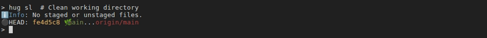
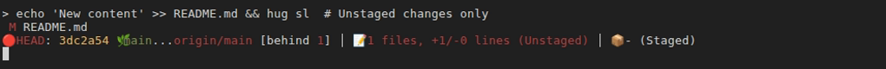
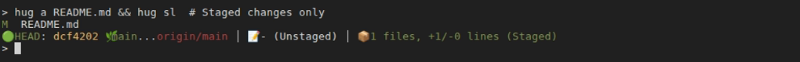

# Status & Staging (s*, a*)

Status and staging commands in Hug provide clear views of your repo state and easy ways to stage/unstage changes. Prefixed with `s` for "status" and `a` for "add/stage."

These enhance Git's `status` and `add` with colored summaries, patches, and smart defaults.

::: info Mnemonic Legend
- **Bold letters** in command names highlight the initials that build each alias (for example, `hug sl` → **S**tatus + **L**ist).
- The **Memory Hook** column repeats that breakdown so you can build muscle memory quickly.
- Safety icons used below: ✅ safe/preview-only · ⚠️ requires caution or forces data removal · 🔄 confirms before running.
  :::

## On This Page
- [Quick Reference](#quick-reference)
- [Status Commands (s*)](#status-commands-s)
- [Staging Commands (a*)](#staging-commands-a)
- [Unstaging](#unstaging)
- [Stash Commands (s* overlap)](#stash-commands-s-overlap)
- [Scenarios](#scenarios)
- [Tips](#tips)
- [Coverage Checklist](#coverage-checklist)

> [!TIP] Command Family Map
> Looking for other families? Try [HEAD Operations (h*)](head) for resets, [Working Directory (w*)](working-dir) for cleanups, or [Logging (l*)](logging) to inspect history before staging.

## Quick Reference

| Command | Memory Hook | Summary |
| --- | --- | --- |
| `hug s` | **S**tatus snapshot | Colored summary of staged/unstaged changes |
| `hug sl` | **S**tatus + **L**ist | Status with listed tracked changes |
| `hug sla` | **S**tatus + **L**ist **A**ll | Status including untracked files |
| `hug ss` | **S**tatus + **S**taged | Show staged diff |
| `hug su` | **S**tatus + **U**nstaged | Show unstaged diff |
| `hug sw` | **S**tatus + **W**orking | Combined staged and unstaged diff |
| `hug a` | **A**dd tracked | Stage tracked changes |
| `hug aa` | **A**dd **A**ll | Stage tracked and untracked changes |
| `hug us` | **U**n**S**tage | Unstage specific files |
| `hug usa` | **U**n**S**tage **A**ll | Unstage everything |

## Status Commands (s*)

### Basic Status
- `hug s`: **S**tatus snapshot
    - **Description**: Quick colored summary of staged/unstaged changes (no untracked files).
    - **Example**: `hug s` (always safe, no args).
    - **Safety**: ✅ Read-only overview; nothing is modified.

- `hug sl`: **S**tatus + **L**ist
    - **Description**: Status with a list of *uncommitted* tracked files (mirrors plain `git status`).
    - **Example**: `hug sl`
    - **Safety**: ✅ Read-only.
    
    ::: details Visual Examples: hug sl in Different States
    
    **Clean Working Directory:**
    
    
    
    **With Unstaged Changes:**
    
    
    
    **With Staged Changes:**
    
    
    
    **Mixed (Staged + Unstaged):**
    
    
    
    :::


- `hug sla`: **S**tatus + **L**ist **A**ll
    - **Description**: Full status including **untracked** files so you can see new additions.
    - **Example**: `hug sla`
    - **Safety**: ✅ Read-only (includes untracked context only).

- `hug sli`: **S**tatus + **L**ist **I**gnored
    - **Description**: Status plus ignored and untracked files to surface items in `.gitignore`.
    - **Example**: `hug sli`
    - **Safety**: ✅ Read-only (great for spotting generated artifacts).

> **Related:** After inspecting status, jump to [Detailed Patches](#detailed-patches) for inline diffs or hop over to [Working Directory (w*)](working-dir) to clean up files you find.

> [!TIP] Scenario
> **Task:** Sanity-check your working tree before pushing.  
> **Flow:** Run `hug sl` for a tracked summary, then `hug sla` if you need to confirm no new files are lingering.

### Detailed Patches
Show diffs inline for better inspection.

- `hug ss [file]`: **S**tatus + **S**taged diff
    - **Description**: Status + staged changes patch (for a file or all files).
    - **Example**: `hug ss src/app.js`
    - **Safety**: ✅ Read-only diff preview.

- `hug su [file]`: **S**tatus + **U**nstaged diff
    - **Description**: Status + unstaged changes patch.
    - **Example**: `hug su`
    - **Safety**: ✅ Read-only diff preview.

- `hug sw [file]`: **S**tatus + **W**orking directory diff
    - **Description**: Status + working directory patch (staged + unstaged).
    - **Example**: `hug sw .`
    - **Safety**: ✅ Read-only diff preview.

- `hug sx`: **S**tatus e**X**press
    - **Description**: Working tree summary with unstaged focus. Options: `--no-color`.
    - **Example**: `hug sx`
    - **Safety**: ✅ Read-only summary (fast overview).

> **Related:** Compare against recent commits with [`hug lp`](logging) or [`hug l`](logging) before deciding whether to amend or discard changes.

> [!TIP] Scenario
> **Task:** Review your commit before amending.  
> **Flow:** Run `hug ss` to verify staged fixes, then `hug su` to ensure no leftovers remain before `hug caa`.

## Staging Commands (a*)

- `hug a [files...]`: **A**dd tracked
    - **Description**: Stage tracked changes (or specific files if provided). If no args, stages updates only. Use `--` to trigger interactive file selection UI.
    - **Example**:
      ```
      hug a                     # Stage all tracked updates
      hug a src/                # Stage directory, including non-tracked files
      hug a --                  # Interactive file selection (requires gum)
      ```
    - **Safety**: ✅ Safe staging (reversible with `hug us`).

- `hug aa`: **A**dd **A**ll
    - **Description**: Stage everything (tracked + untracked + deletions).
    - **Example**: `hug aa` (use carefully).
    - **Safety**: ⚠️ Sweeps all changes - run `hug sla` first to confirm what's included.

- `hug ai`: **A**dd + **I**nteractive
    - **Description**: Interactive add menu (Git's `-i`).
    - **Example**: `hug ai`
    - **Safety**: ✅ Interactive preview before staging.

- `hug ap`: **A**dd + **P**atch
    - **Description**: Interactive patch staging (hunk-by-hunk).
    - **Example**: `hug ap`
    - **Safety**: ✅ Interactive hunk selection.

> **Related:** Once staged, continue with [Commits (c*)](commits) like `hug c` or `hug caa` to record the snapshot.

> [!TIP] Scenario
> **Task:** Stage only your lint fixes.  
> **Flow:** Run `hug ap` to choose specific hunks, then `hug ss` to confirm before committing with `hug c`.

## Unstaging
- `hug us <files...>`: **U**n**S**tage specifics
    - **Description**: Unstage specific files.
    - **Example**: `hug us file.js`
    - **Safety**: ✅ Only affects the index; your working tree stays untouched.

- `hug usa`: **U**n**S**tage **A**ll
    - **Description**: Unstage all files.
    - **Example**: `hug usa`
    - **Safety**: ⚠️ Clears the entire staging area - review with `hug sl` afterward.

- `hug untrack <files...>`
    - **Description**: Stop tracking files but keep them locally (e.g., for secrets).
    - **Example**: `hug untrack .env`
    - **Safety**: ⚠️ Removes files from version control; make sure `.gitignore` covers them to prevent re-adding.

> **Related:** If you need to toss changes entirely, jump to [`hug w discard`](working-dir) or [`hug w wip`](working-dir) for safe checkpoints.

> [!TIP] Scenario
> **Task:** You staged a compiled artifact by mistake.  
> **Flow:** Run `hug us dist/app.js`, add it to `.gitignore`, then `hug untrack dist/` so it stays local only.

## Scenarios
::: tip Scenario: Patch-and-Push
**Goal:** Ship a small change without noise.
1. `hug sl` to verify tracked files.
2. `hug ap` to stage only the relevant hunk.
3. `hug ss` to double-check the staged diff, then `hug c "Describe change"`.
4. `hug bpush` to publish.
   :::

::: tip Scenario: Recover from Experimental Edits
**Goal:** Restore a clean working tree after a spike.
1. `hug sla` to spot all touched files.
2. `hug w wip "Spike backup"` for a safety net.
3. `hug w discard-all` for tracked changes, followed by `hug w purge` for generated files.
4. Finish with `hug s` to confirm you're clean.
   :::

## Tips
- Use `hug s`/`hug sl` as your heartbeat commands; rerun them after every change to stay oriented.
- When staging aggressively with `hug aa`, follow with `hug ss` and `hug su` to ensure nothing surprising slips in.
- Combine `hug sl` with `hug llf` from [Logging (l*)](logging#file-inspection) to tie current work back to file history.
- Share concise stand-up updates by pasting `hug sx` output or attaching diffs from `hug ss`.
