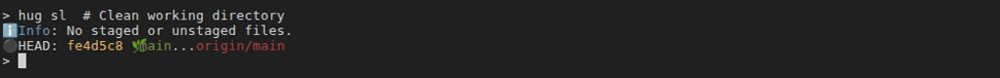
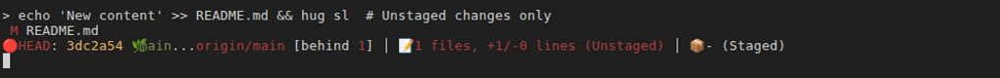
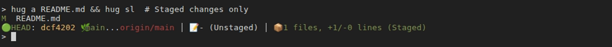

# Status & Staging (s*, a*)

Status and staging commands in Hug provide clear views of your repo state and easy ways to stage/unstage changes. Prefixed with `s` for "status" and `a` for "add/stage."

These enhance Git's `status` and `add` with colored summaries, patches, and smart defaults.

::: info Mnemonic Legend
- **Bold letters** in command names highlight the initials that build each alias (for example, `hug sl` → **S**tatus + **L**ist).
- The **Memory Hook** column repeats that breakdown so you can build muscle memory quickly.
- Safety icons used below: ✅ safe/preview-only · ⚠️ requires caution or forces data removal · 🔄 confirms before running.
  :::

## On This Page
- [Quick Reference](#quick-reference)
- [Status Commands (s*)](#status-commands-s)
- [Visual diff (hug dd)](#visual-diff-hug-dd)
- [Staging Commands (a*)](#staging-commands-a)
- [Unstaging](#unstaging)
- [Stash Commands (s* overlap)](#stash-commands-s-overlap)
- [Scenarios](#scenarios)
- [Tips](#tips)
- [Coverage Checklist](#coverage-checklist)

> [!TIP] Command Family Map
> Looking for other families? Try [HEAD Operations (h*)](head) for resets, [Working Directory (w*)](working-dir) for cleanups, or [Logging (l*)](logging) to inspect history before staging.

## Quick Reference

| Command | Memory Hook | Summary |
| --- | --- | --- |
| `hug s` | **S**tatus snapshot | Colored summary of staged/unstaged changes; supports query flags for scripting |
| `hug sl` | **S**tatus + **L**ist | Status with listed tracked changes |
| `hug sla` | **S**tatus + **L**ist **A**ll | Status including untracked files |
| `hug ss` | **S**tatus + **S**taged | Show staged diff |
| `hug su` | **S**tatus + **U**nstaged | Show unstaged diff |
| `hug sw` | **S**tatus + **W**orking | Combined staged and unstaged diff |
| `hug dd` | **D**ir-**D**iff (visual) | Visual side-by-side difftool: `dd s`/`u`/`w` — see [Visual diff](#visual-diff-hug-dd) |
| `hug a` | **A**dd tracked | Stage tracked changes |
| `hug aa` | **A**dd **A**ll | Stage tracked and untracked changes |
| `hug us` | **U**n**S**tage | Unstage specific files |
| `hug usa` | **U**n**S**tage **A**ll | Unstage everything |

## Status Commands (s*)

### Basic Status
- `hug s`: **S**tatus snapshot
    - **Description**: Quick colored summary of staged/unstaged changes (no untracked files). Also supports query flags for scriptable field extraction.
    - **Example**: `hug s` (always safe, no args), `hug s -r` (remote URL), `hug s -b -r -u` (branch, remote, upstream).
    - **Safety**: ✅ Read-only overview; nothing is modified.

    ::: details Query Flags
    When any query flag is passed, `hug s` enters **query mode**: individual fields are printed to stdout (one per line by default, NUL-separated with `-z`), with no colored output or chatter on stderr. Computation is lazy — only requested fields incur git operations.

    | Flag | Field | Notes |
    | --- | --- | --- |
    | `-b, --branch` | Current branch name | Empty if detached HEAD |
    | `-r, --remote` | URL of tracking remote | Empty if no upstream |
    | `-u, --upstream` | Upstream tracking branch | Empty if none |
    | `-H, --hash` | Full commit hash | HEAD |
    | `-s, --short-hash` | Short commit hash | HEAD |
    | `-A, --ahead` | Commits ahead of upstream | Count |
    | `-B, --behind` | Commits behind upstream | Count |
    | `-C, --counts` | Combined ahead/behind | `ahead behind` |
    | `-I, --ignored` | Ignored file count | |
    | `-K, --untracked` | Untracked file count | |
    | `-S, --staged` | Staged file count | |
    | `-U, --unstaged` | Unstaged file count | |
    | `--ball` | State emoji | Encodes repo state |
    | `-z, --null` | NUL separator | Use with other query flags |
    | `--json` | Full JSON output | Mutually exclusive with query flags |

    Query flags are mutually exclusive with `--json`. Combine freely:
    ```
    hug s -r                    # URL of tracking remote
    hug s -b -r -u              # Branch, remote URL, upstream (tab-separated)
    hug s -z -b -H | xargs -0  # NUL-separated for unusual names
    ```
    :::

- `hug sl`: **S**tatus + **L**ist
    - **Description**: Status with a list of *uncommitted* tracked files (mirrors plain `git status`).
    - **Example**: `hug sl`
    - **Safety**: ✅ Read-only.
    
    ::: details Visual Examples: hug sl in Different States
    
    **Clean Working Directory:**
    
    
    
    **With Unstaged Changes:**
    
    
    
    **With Staged Changes:**
    
    
    
    **Mixed (Staged + Unstaged):**
    
    
    
    :::


- `hug sla`: **S**tatus + **L**ist **A**ll
    - **Description**: Full status including **untracked** files so you can see new additions.
    - **Example**: `hug sla`
    - **Safety**: ✅ Read-only (includes untracked context only).

- `hug sli`: **S**tatus + **L**ist **I**gnored
    - **Description**: Status plus ignored and untracked files to surface items in `.gitignore`.
    - **Example**: `hug sli`
    - **Safety**: ✅ Read-only (great for spotting generated artifacts).

> **Related:** After inspecting status, jump to [Detailed Patches](#detailed-patches) for inline diffs or hop over to [Working Directory (w*)](working-dir) to clean up files you find.

> [!TIP] Scenario
> **Task:** Sanity-check your working tree before pushing.  
> **Flow:** Run `hug sl` for a tracked summary, then `hug sla` if you need to confirm no new files are lingering.

### Detailed Patches
Show diffs inline for better inspection.

- `hug ss [file]`: **S**tatus + **S**taged diff
    - **Description**: Status + staged changes patch (for a file or all files). By default shows both patch and statistics. Use `--stat` for statistics only or `--no-stats` for patch only. Use `--` to interactively select from staged files.
    - **Example**:
      ```
      hug ss                 # Show all staged changes (patch + stats)
      hug ss --stat          # Show only staged statistics
      hug ss --no-stats      # Show only staged patch (no statistics)
      hug ss src/app.js      # Show staged changes for specific file
      hug ss --              # Interactive file selection from staged files
      ```
    - **Safety**: ✅ Read-only diff preview.

- `hug su [file]`: **S**tatus + **U**nstaged diff
    - **Description**: Status + unstaged changes patch. By default shows both patch and statistics. Use `--stat` for statistics only or `--no-stats` for patch only. Use `--` to interactively select from unstaged files.
    - **Example**:
      ```
      hug su                 # Show all unstaged changes (patch + stats)
      hug su --stat          # Show only unstaged statistics
      hug su file.txt        # Show unstaged changes for specific file
      hug su --stat file.txt # Show stats for specific file only
      hug su --              # Interactive file selection from unstaged files
      ```
    - **Safety**: ✅ Read-only diff preview.

- `hug sw [file]`: **S**tatus + **W**orking directory diff
    - **Description**: Status + working directory patch (staged + unstaged). By default shows both patch and statistics. Use `--stat` for statistics only. Use `--` to interactively select from changed files.
    - **Example**:
      ```
      hug sw                 # Show all working directory changes (patch + stats)
      hug sw --stat          # Show only statistics (no patches)
      hug sw .               # Show all changes in current directory
      hug sw --              # Interactive file selection from changed files
      ```
    - **Safety**: ✅ Read-only diff preview.

- `hug sx`: **S**tatus e**X**press
    - **Description**: Working tree summary with unstaged focus. Options: `--no-color`.
    - **Example**: `hug sx`
    - **Safety**: ✅ Read-only summary (fast overview).

> **Related:** Compare against recent commits with [`hug lp`](logging) or [`hug l`](logging) before deciding whether to amend or discard changes.

> [!TIP] Scenario
> **Task:** Review your commit before amending.  
> **Flow:** Run `hug ss` to verify staged fixes, then `hug su` to ensure no leftovers remain before `hug caa`.

## Visual diff: `hug dd`

`hug dd` opens a **visual side-by-side difftool** (e.g. kitty diff) instead of printing a text patch. It's the **visual-diff gateway**: the `s`/`u`/`w` subcommands mirror the working-tree text family `ss`/`su`/`sw`, while a **committish / range / N** shows commit-history diffs — the visual counterpart to `shp`/`shcp` (also reachable under the show-family name `hug shv`).

| Command | Shows | Compares |
| --- | --- | --- |
| `hug dd s` | Staged | index vs HEAD |
| `hug dd u` | Unstaged | worktree vs index |
| `hug dd w` (or bare `hug dd`) | All uncommitted (net) | worktree vs HEAD |
| `hug dd <committish>` / `hug dd N` | That commit's **introduced** diff | commit vs its first parent (root → empty tree) |
| `hug dd <range>` / `hug dd -N` | A range (cumulative) | endpoints, e.g. `HEAD~3..HEAD` |

```sh
hug dd s              # staged changes, visual
hug dd u              # unstaged changes, visual
hug dd w              # ALL uncommitted changes (same as bare `hug dd`)
hug dd HEAD           # the patch HEAD introduced (= hug shp HEAD, visual)
hug dd 3              # the patch of the commit 3 back (HEAD~3)
hug dd -3             # cumulative diff of the last 3 commits (HEAD~3..HEAD)
hug dd v1.0..HEAD     # cumulative diff across a range
hug dd w -- src/      # scope to a path
hug dd --             # pick files interactively, then one difftool window
```

> [!NOTE]
> A **committish** means *that commit's own patch* (like `git show`), so `hug dd HEAD`
> shows HEAD's changes — distinct from bare `hug dd`, which shows your *uncommitted*
> work. (`hug dd HEAD` ≡ `hug shp HEAD`, just visual.) A **range** (or `-N`) shows the
> cumulative endpoint diff like `hug shcp`; a merge is diffed against its first parent.
> Numbers use the same `N`/`-N` convention as `hug sh`.

### Net view vs the two-section split

Git holds your work as a chain of three snapshots:

```
HEAD (last commit)  →  index (staging area)  →  working tree (files on disk)
```

`hug sw` (text) shows this chain as **two diffs**: a *staged* section (`HEAD → index`) and an *unstaged* section (`index → worktree`). `hug dd w` shows only the **endpoints** as a single diff (`HEAD → worktree`) — it must, because `git difftool --dir-diff` opens the tool once on two snapshots and can't render two sections without launching it twice (poor UX).

Collapsing the middle means the two steps can cancel out. Example — `config.txt` is `port = 80` at HEAD:

1. Change it to `port = 8080` and **stage** it (index = `8080`).
2. Then edit the working file **back** to `port = 80`.

| View | Shows |
| --- | --- |
| `hug sw` | **two** changes: staged `80 → 8080`, unstaged `8080 → 80` |
| `hug dd w` | **nothing** — HEAD (`80`) and worktree (`80`) are identical → `No changes.` |

This is intentional, not a bug. `dd w` answers *"what does my tree look like vs my last commit?"* (the common case). When you need the exact staged-vs-unstaged split, use **`hug dd s` + `hug dd u`** (each diffs one link of the chain) or the text view **`hug sw`**.

> [!TIP]
> `hug dd` needs a difftool configured in git (`diff.tool` + `difftool.<name>.cmd`). It is interactive/TTY-only and refuses to run in a pipe — for pipe-safe patch output use `hug ss` / `hug su` / `hug sw`.

## Staging Commands (a*)

- `hug a [files...]`: **A**dd tracked
    - **Description**: Stage tracked changes (or specific files if provided). If no args, stages updates only. Use `--` to trigger interactive file selection UI.
    - **Example**:
      ```
      hug a                     # Stage all tracked updates
      hug a src/                # Stage directory, including non-tracked files
      hug a --                  # Interactive file selection (requires gum)
      ```
    - **Safety**: ✅ Safe staging (reversible with `hug us`).

- `hug aa`: **A**dd **A**ll
    - **Description**: Stage everything (tracked + untracked + deletions).
    - **Example**: `hug aa` (use carefully).
    - **Safety**: ⚠️ Sweeps all changes - run `hug sla` first to confirm what's included.

- `hug ai`: **A**dd + **I**nteractive
    - **Description**: Interactive add menu (Git's `-i`).
    - **Example**: `hug ai`
    - **Safety**: ✅ Interactive preview before staging.

- `hug ap`: **A**dd + **P**atch
    - **Description**: Interactive patch staging (hunk-by-hunk).
    - **Example**: `hug ap`
    - **Safety**: ✅ Interactive hunk selection.

> **Related:** Once staged, continue with [Commits (c*)](commits) like `hug c` or `hug caa` to record the snapshot.

> [!TIP] Scenario
> **Task:** Stage only your lint fixes.  
> **Flow:** Run `hug ap` to choose specific hunks, then `hug ss` to confirm before committing with `hug c`.

## Unstaging
- `hug us <files...>`: **U**n**S**tage specifics
    - **Description**: Unstage specific files.
    - **Example**: `hug us file.js`
    - **Safety**: ✅ Only affects the index; your working tree stays untouched.

- `hug usa`: **U**n**S**tage **A**ll
    - **Description**: Unstage all files.
    - **Example**: `hug usa`
    - **Safety**: ⚠️ Clears the entire staging area - review with `hug sl` afterward.

- `hug untrack <files...>`
    - **Description**: Stop tracking files but keep them locally (e.g., for secrets).
    - **Example**: `hug untrack .env`
    - **Safety**: ⚠️ Removes files from version control; make sure `.gitignore` covers them to prevent re-adding.

> **Related:** If you need to toss changes entirely, jump to [`hug w discard`](working-dir) or [`hug w wip`](working-dir) for safe checkpoints.

> [!TIP] Scenario
> **Task:** You staged a compiled artifact by mistake.  
> **Flow:** Run `hug us dist/app.js`, add it to `.gitignore`, then `hug untrack dist/` so it stays local only.

## Scenarios
::: tip Scenario: Patch-and-Push
**Goal:** Ship a small change without noise.
1. `hug sl` to verify tracked files.
2. `hug ap` to stage only the relevant hunk.
3. `hug ss` to double-check the staged diff, then `hug c "Describe change"`.
4. `hug bpush` to publish.
   :::

::: tip Scenario: Recover from Experimental Edits
**Goal:** Restore a clean working tree after a spike.
1. `hug sla` to spot all touched files.
2. `hug w wip "Spike backup"` for a safety net.
3. `hug w discard-all` for tracked changes, followed by `hug w purge` for generated files.
4. Finish with `hug s` to confirm you're clean.
   :::

## Tips
- Use `hug s`/`hug sl` as your heartbeat commands; rerun them after every change to stay oriented.
- When staging aggressively with `hug aa`, follow with `hug ss` and `hug su` to ensure nothing surprising slips in.
- Combine `hug sl` with `hug llf` from [Logging (l*)](logging#file-inspection) to tie current work back to file history.
- Share concise stand-up updates by pasting `hug sx` output or attaching diffs from `hug ss`.
