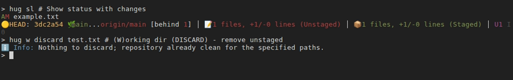
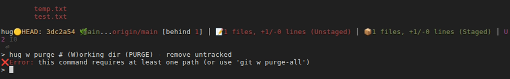

# Working Directory (w *)

Working Directory commands in Hug help you manage, clean up, and restore changes in your local files.
They live under the `w` (for "working directory") gateway.
They range from safe discards to nuclear cleanups, always with previews.

Some of them can also be accessed directly (without using `h` before them):
- `hug get` (same as `hug w get`)
- `hug wip` (same as `hug w wip`)
- `hug wips` (same as `hug w wips`)
- `hug unwip` (same as `hug w unwip`)

## Directory Scoping

Many `w` commands support interactive file selection with intelligent scoping:

- **Default behavior**: When run without explicit paths, interactive commands (`discard`, `purge`, `zap`) **scope to the current directory and subdirectories**.
  - Running `hug w discard` from `src/java/` shows only files in `src/java/` and its subdirectories
  - File paths are displayed relative to your current location (e.g., `main.java` not `src/java/main.java`)
  - This reduces noise and cognitive load in large repositories or monorepos

- **Full repository scope**: Use `--browse-root` flag to browse files across the entire repository
  - Example: `hug w discard --browse-root` shows all changed files in the repo
  - Cannot be combined with explicit file paths

- **Explicit paths**: Always interpreted relative to current directory
  - Example: In `src/java/`, `hug w discard main.java` targets `src/java/main.java`
  - Works naturally from any directory without requiring full repository paths

This scoping mirrors Git's native `-- .` behavior and provides an intuitive, focused view for directory-specific workflows.


## Quick Reference

| Command             | Memory Hook                             | Summary                                                 |
|---------------------|-----------------------------------------|---------------------------------------------------------|
| `hug w discard`     | **W**orking directory **D**iscard       | Discard unstaged or staged changes in     tracked files |
| `hug w discard-all` | **W**orking directory **discard **ALL** | Discard unstaged or staged changes in ALL tracked files |
| `hug w wipe`        | **W**orking directory **W**ipe          | Discard uncommitted changes in     tracked files        |
| `hug w wipe-all`    | **W**orking directory **W**ipe **ALL**  | Discard uncommitted changes in ALL tracked files        |
| `hug w purge`       | **W**orking directory **P**urge         | Remove     untracked or ignored files                   |
| `hug w purge-all`   | **W**orking directory **P**urge **ALL** | Remove ALL untracked or ignored files                   |
| `hug w zap`         | **W**orking directory **Z**ap           | Combine wipe + purge for     files                      |
| `hug w zap-all`     | **W**orking directory **Z**ap **ALL**   | Combine wipe + purge for ALL files                      |
| `hug w wip`         | **W**ork **I**n **P**rogress            | Park changes on new WIP branch (pushable)               |
| `hug w wips`        | **W**ork **I**n **P**rogress, **S**tay  | Park changes on new  WIP branch and stay on it          |
| `hug w unwip`       | **Un**park **W**ork **I**n **P**rogress | Squash-merge WIP to current branch + delete WIP         |
| `hug w wipdel`      | **W**ork **I**n **P**rogress **DEL**ete | Delete WIP branch (no integration)                      |
| `hug w get`         | **W**orking directory **G**et           | Restore files from a specific commit                    |

## Commands

### Discard Changes
Discard unstaged or staged **changes in _tracked_** files without affecting **untracked / ignored** files.

- `hug w discard [-u|-s] [--browse-root] <files...>`
  - **Description**: Discard unstaged (`-u`, default) or staged (`-s`) changes for specific files/paths.
  - **Scoping**: By default, when run without explicit paths, shows only files from current directory and subdirectories. Use `--browse-root` to browse the entire repository.
  - **Example**:
    ```shell
    hug w discard file.js     # Discard unstaged changes in file.js (CWD-relative)
    hug w discard -s .        # Discard all staged changes in current directory
    hug w discard --browse-root # Interactive selection from entire repository
    ```
  - **Path Behavior**: 
    - Without arguments: Interactive UI scoped to current directory (shows `main.java` not `src/java/main.java`)
    - With `--browse-root`: Interactive UI shows entire repository
    - With explicit paths: Paths are relative to current directory (e.g., `main.java` in `src/java/` targets `src/java/main.java`)
  - **Safety**: `--dry-run` to preview; requires `-f` to force.
  - 

- `hug w discard-all [-u|-s]`
  - **Description**: Repo-wide discard of unstaged or staged changes.
  - **Example**: `hug w discard-all` (default: unstaged).

### Wipe Changes
Discard uncommitted changes (both staged and unstaged) in **_tracked_** files without affecting **untracked / ignored** files.

- `hug w wipe <files...>`
  - **Description**: Wipe staged + unstaged for specific files (tracked only).
  - **Example**: `hug w wipe src/*.js`

- `hug w wipe-all`
  - **Description**: Wipe all tracked files to clean state.
  - **Safety**: Confirmation required; `--dry-run` available.

### Purge Untracked
Remove untracked or ignored files (e.g., build artifacts).

- `hug w purge [-u|-i] [--browse-root] <paths...>`
  - **Description**: Purge untracked (`-u`, default) or ignored (`-i`) files/paths.
  - **Scoping**: By default, when run without explicit paths, shows only files from current directory and subdirectories. Use `--browse-root` to browse the entire repository.
  - **Example**: 
    ```shell
    hug w purge -i node_modules/     # Purge ignored files in node_modules/
    hug w purge --browse-root        # Interactive selection from entire repository
    ```
  - **Path Behavior**: Same as `discard` - paths are CWD-relative, UI shows simplified paths
  - 

- `hug w purge-all [-u|-i]`
  - **Description**: Repo-wide purge.
  - **Safety**: `--dry-run`; `-f` to skip prompts.

### Zap (Nuclear Cleanup)
Combines wipe + purge for full reset.

- `hug w zap [--browse-root] <paths...>`
  - **Description**: Full cleanup (discard + purge) for paths.
  - **Scoping**: By default, when run without explicit paths, shows only files from current directory and subdirectories. Use `--browse-root` to browse the entire repository.
  - **Example**: 
    ```shell
    hug w zap my-file              # Full cleanup for my-file (careful!)
    hug w zap --browse-root        # Interactive selection from entire repository
    ```
  - **Path Behavior**: Same as `discard` and `purge` - paths are CWD-relative, UI shows simplified paths

- `hug w zap-all`
  - **Description**: Complete repo reset - tracked to clean, untracked/ignored removed.
  - **Safety**: Always previews and confirms; use with caution.

### Utilities
- `hug w get <commit> [files...]`
  - **Description**: Restore files from a specific commit to working directory. Use `--` to trigger interactive file selection UI (requires gum).
  - **Example**:
    ```shell
    hug w get HEAD~2 README.md    # Gets from 2 commits ago
    hug w get HEAD~2 --           # Interactive file selection from HEAD~2
    ```

### The WIP Workflow: A Better Way to Manage Temporary Work {#wip-workflow}

The WIP (Work-In-Progress) workflow is a robust, branch-based approach to parking temporary work.
It provides a safer and more powerful alternative to features found in other version control systems like `git stash` or Mercurial's *MQ*.
It lets you park changes on a dedicated, dated branch that you can push, share, and resume safely when needed.

| Command           | Use Case                                                                         | Switches Branches? |
| ----------------- |----------------------------------------------------------------------------------|--------------------|
| `hug w wip "msg"`   | **Quick Interruption**: Park work to handle something else.                      | **No**             |
| `hug w wips "msg"`  | **Focused Work**: (WIP + **S**tay on it) Park work to iterate on it immediately. | **Yes**            |
| `hug w unwip`     | **Finish** : Integrate completed WIP into your main branch.                      | No                 |
| `hug w wipdel`    | **Abandon**: Delete an unfruitful WIP branch.                                    | No                 |

#### The Lifecycle of a WIP Branch

**1. Park Your Work**

- To handle a quick interruption (e.g., a hotfix):
  ```shell
  # Parks all changes (staged, unstaged, and untracked) on a new WIP branch,
  # leaving working directory clean for a new, unrelated task.
  hug w wip "Drafting the new feature, pausing for hotfix"
  ```

- To start a focused experimental session:
  ```shell
  # Moves all changes (staged, unstaged, and untracked) to a new WIP branch
  # and stays on it for further work.
  hug w wips "Spike on new auth API"
  ```

**2. Resume Your Work**

If you used `hug w wip`, you can resume your work at any time by switching to the WIP branch that was created.

```shell
# List WIP branches and switch to one
hug bl | grep WIP
hug b WIP/24-10-26/1530.spikeonnewauthapi
```
If you used `hug w wips`, you are already on the new WIP branch and can add more commits.

**3. Finish and Integrate (`unwip`)**

When the work is complete, switch to your target branch (e.g., `main`) and "unpark" it. By default, this squash-merges the WIP branch's changes into a single, clean commit and then deletes the WIP branch. For a regular merge that creates a merge commit, use the `--no-squash` option.

```shell
# 1. Switch to your target branch
hug b main

# 2. Unpark the WIP branch (prompts for selection if name is omitted)
hug w unwip WIP/24-10-26/1530.spikeonnewauthapi # Squash-merge by default

hug w unwip --no-squash WIP/24-10-26/1530.spikeonnewauthapi # Perform a regular merge
```

> [!TIP] Unwip Tips
> - You can resume work on a WIP branch (`hug b <wip>`), add more commits, then switch back to your target branch and run `hug w unwip` to bring those changes in.
> - After unparking, run `hug s` to check the status and `hug bpush` to push the new commit.

**4. Abandon and Delete (`wipdel`)**

If the experiment was a dead end, you can delete the WIP branch without merging its changes. The command will attempt a safe deletion, but if the branch contains unmerged work, you will need to use the `--force` flag to discard it.

```shell
# Deletes the branch. Fails if not fully merged.
hug w wipdel WIP/24-10-26/1530.spikeonnewauthapi

# Force-deletes the branch even if it has unmerged work.
hug w wipdel --force WIP/24-10-26/1530.spikeonnewauthapi
```

> [!TIP] Why Use WIP Instead of Stash?
> - **Persistent & Safe**: Stashes are local and can be lost. WIP branches are real commits.
> - **Shareable**: You can `hug bpush` a WIP branch to get feedback or save it remotely.
> - **Versioned**: You can add multiple commits to a WIP branch, creating a history for your experiment.
> - **Clear**: `hug bl | grep WIP` gives a clear list of parked tasks.

## Tips
- Chain with status: `hug w discard file.js && hug sl`
- For undoing HEAD moves that affect working dir, see [HEAD Operations](head).
- For WIP: Park with `hug wip` (changes moved out of your way into a new WIP branch) or `hug wips` (changes moved to new WIP branch, working dir stays on it), resume with `hug b <wip>`, finish with `hug w unwip` or discard with `hug w wipdel`.
