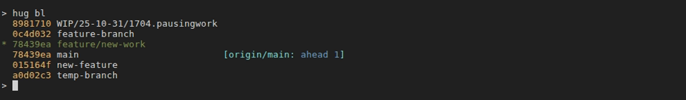
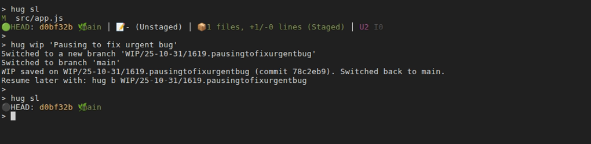
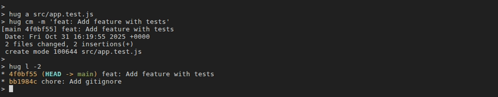
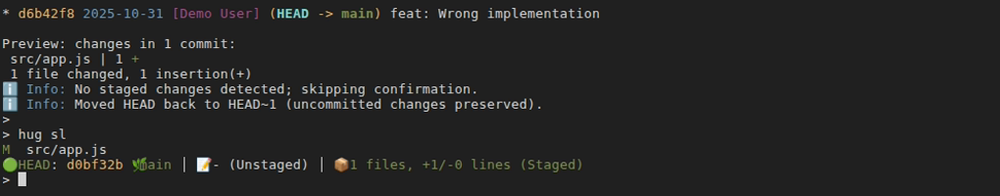
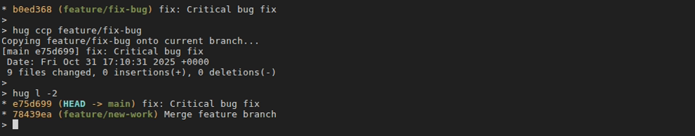
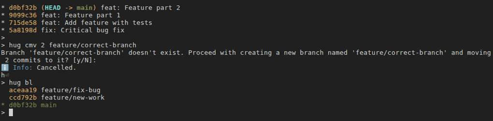

# Practical Workflows with Hug SCM

You've learned the basics of version control with the [Beginner's Guide](hug-for-beginners.md) and understand concepts like commits and branches. Now, it's time to level up. This guide shows you how to combine Hug's commands into fluid, powerful workflows that you'll use every day in a professional development environment.

We'll structure this guide around the typical lifecycle of building a feature, from a fresh branch to a clean merge.

[[toc]]

::: info Mnemonic Legend
- **Bold letters** in command names highlight the initials that make each alias (for example, `hug sl` → **S**tatus + **L**ist).
- For deep dives on specific commands, refer to the command reference pages (e.g., `[Working Directory (w*)](commands/working-dir.md)`).
:::

## The Core Development Cycle

This workflow is the backbone of most feature development.

### 1. Starting a New Task

**Scenario:** You're about to start work on a new feature, "user-authentication". First, you need a clean, up-to-date branch.

**Workflow:**
1.  **Switch to the main branch**: `hug b main` (**B**ranch)
2.  **Get the latest updates**: `hug bpullr` (**B**ranch **Pull** with **R**ebase)
3.  **Create your feature branch**: `hug bc feature/user-authentication` (**B**ranch **C**reate`)


 
**Why it works:** This sequence ensures you start from the most recent version of the main branch, which helps prevent merge conflicts later. Using `bpullr` maintains a clean, linear project history.

### 2. The "Inner Loop": Code, Commit, Repeat

This is where you'll spend most of your time: writing code and saving progress. The goal is to make small, logical "atomic" commits.

**Scenario:** You've implemented the login form and want to commit it.

**Workflow:**
1.  **Check your status**: `hug sla` (**S**tatus **L**ist **A**ll) to see tracked and untracked files.
2.  **Review your changes**: `hug sw` (**S**tatus **W**orking diff) shows a combined diff of everything.
3.  **Stage your changes**:
    *   For everything: `hug aa` (**A**dd **A**ll)
    *   For just one part of a file: `hug ap` (**A**dd **P**atch) for an interactive staging session.
4.  **Commit**: `hug c "feat: Add user login form"`
 
#### Handling Interruptions: The WIP Workflow
**Scenario:** You're in the middle of a complex change when an urgent bug report comes in. You can't commit your broken code, but you can't lose it either. This is what the WIP (Work-In-Progress) workflow is for.
 
**Workflow:**
1.  **Park your current work**: `hug wip "Refactoring user model"` (**W**ork **I**n **P**rogress)
    *   This command takes all your changes (staged, unstaged, and untracked), commits them to a new, dated WIP branch, and cleans your working directory. You remain on your original feature branch.
2.  **Switch to a hotfix branch**: `hug b main && hug bc hotfix/urgent-bug`
3.  **Fix the bug, merge it, and return**: `# ... do the work ...`
4.  **Resume your work**: `hug b feature/user-authentication` and then `hug w unwip` (**Un**park **WIP**). Select the WIP branch you created.
    *   This squash-merges the work from the WIP branch back into your feature branch, restoring your changes so you can continue where you left off.


 
The WIP workflow is a safer, more robust alternative to `git stash`. See the [WIP Workflow Guide](commands/working-dir.md#wip-workflow) for more details.
 
#### Fixing Your Last Commit
**Scenario:** You just committed, but you forgot to include a file, or you made a typo in the commit message.
 
**Workflow:**
1.  **Stage the missing file**: `hug a forgotten-file.js` (**A**dd)
2.  **Modify the most recent commit**: `hug cm` (**C**ommit **M**odify)
    *   This opens your editor with the last commit message, allowing you to edit it. When you save and close, the staged changes will be added to that commit instead of creating a new one. This keeps your history clean.


 
### 3. Preparing for Review
**Scenario:** Your feature is complete! Before you create a pull request, you want to clean up your commit history. You might have several "WIP" or "fixup" commits that should be combined into one or two logical commits.
 
**Workflow:**
1.  **Sync with the main branch**: `hug bpullr` to pull the latest changes from `main` and replay your local commits on top. This is the best time to resolve any conflicts.
2.  **Start an interactive history edit**: `hug rbi main` (**R**ebase **I**nteractive)
    *   This opens an editor with a list of all the commits you've made on your feature branch.
    *   You can reorder them, `reword` their messages, `squash` them into the commit above them, or `fixup` (squash without keeping the message).
3.  **Push your clean branch**: `hug bpushf` (**B**ranch **Push** **F**orce)
    *   Because you've rewritten history, a normal push will be rejected. A safe force push (`hug bpushf`) is required. **Only do this on your own feature branch that no one else is using.**

### 3a. Cherry-Picking a Critical Fix with `hug ccp`
**Scenario:** While working on your feature branch, you discover a critical bug in the main branch. You fix it locally, but need to apply the fix to main immediately without merging your entire feature.

**Workflow:**
1.  **Identify the fix commit**: After committing your bug fix on the feature branch, note the commit hash (e.g., from `hug l -1`)
2.  **Switch to main**: `hug b main` (**B**ranch)
3.  **Pull the latest**: `hug bpull` (**B**ranch **Pull**)
4.  **Copy the fix**: `hug ccp a1b2c3d` (**C**ommit **C**o**P**y) where `a1b2c3d` is your fix commit
5.  **Push the fix**: `hug bpush` (**B**ranch **Push**)
6.  **Return to your feature**: `hug b feature/user-authentication`

**Why it works:** Cherry-picking (`ccp`) lets you selectively copy individual commits between branches. The original commit hash is preserved in the commit message (via `-x` flag), maintaining full traceability. This is perfect for hotfixes, backports, or applying specific changes without merging everything.

**Pro tip:** If you need to cherry-pick multiple commits, you can specify them all at once: `hug ccp a1b2c3d e4f5g6h i7j8k9l`

### 3b. Rescuing Commits on the Wrong Branch with `hug cmv`
**Scenario:** You've been coding for an hour and made 3 great commits... but you just realized you're on `main` instead of your feature branch! Or worse, you meant to create a new branch but forgot.

**Traditional Git approach** (complex and error-prone):
```shell
git checkout -b feature/oops        # Create the right branch
git checkout main                   # Go back to main
git reset --hard HEAD~3             # Remove commits from main (scary!)
```

**The Hug way** (simple and safe):
```shell
hug cmv 3 feature/new-feature      # Move last 3 commits to new branch
```

**What just happened:**
1.  Hug created a new branch `feature/new-feature` at your current position
2.  Moved HEAD on `main` back 3 commits (keeping your working directory clean)
3.  Automatically switched you to `feature/new-feature` so you can continue working
4.  All in one command!

**Even better - moving to an existing branch:**
```shell
hug cmv 2 feature/existing         # Move last 2 commits to existing branch
```

Hug will cherry-pick your commits onto the existing branch, then reset the current branch back. You end up on `feature/existing`, ready to continue.

**The ultimate rescue - using upstream mode:**
```shell
hug cmv -u feature/local-work      # Move all local-only commits to new branch
```

This moves ALL commits that aren't yet on the remote, perfect for when you've been working offline or forgot to create a branch from the start.

**Why `cmv` is powerful:**
- **One command instead of many**: No need for multiple git commands with arcane flags
- **Safe by default**: Shows you what will happen and asks for confirmation (use `--force` to skip)
- **Automatic branch switching**: Lands you on the target branch ready to continue
- **Works with ranges**: `hug cmv a1b2c3 feature/fix` moves all commits after `a1b2c3`
 
### 4. Merging and Cleaning Up
**Scenario:** Your pull request has been approved and merged!
 
**Workflow:**
1.  **Switch to main and update**: `hug b main && hug bpull`
2.  **Delete your local feature branch**: `hug bdel feature/user-authentication` (**B**ranch **DEL**ete)
3.  **Delete the remote feature branch**: `hug bdelr feature/user-authentication` (**B**ranch **DEL**ete **R**emote)
 
## Specialized Workflows
 
### Investigating History
**Scenario:** A bug was introduced recently, and you need to find out when and why.
 
**Workflow:**
*   **Find the last change to a file**: `hug llf <file> -1` (**L**og **L**ookup **F**ile) shows the most recent commit that touched a file, even if it was renamed.
*   **Search commit messages**: `hug lf "keyword"` (**L**og **F**ilter) searches all commit messages for a term.
*   **Search code changes (the "pickaxe" search)**: `hug lc "functionName"` (**L**og **C**ode search) finds commits where `functionName` was added or removed.
*   **See who changed what**: `hug fblame <file>` (**F**ile **B**lame) shows the author of every line in a file.
 
### Undoing Mistakes Safely
There are two main ways to undo work, depending on whether the mistake is public (pushed) or private (local).
 
*   **Local Mistake: "I just made a bad commit on my machine."**
    *   **Solution**: `hug h back` (**H**EAD **B**ack). This moves the branch pointer back one commit but **keeps your changes staged**. You can edit them and re-commit correctly. It's the safest way to undo a local commit.
    *   Use `hug h undo` (**H**EAD **Undo**) to do the same, but leave the changes in your working directory (unstaged).
    *   
 
*   **Public Mistake: "I pushed a commit that broke the build."**
    *   **Solution**: `hug revert <commit-hash>` (**Revert** a commit). This creates a *new* commit that is the exact opposite of the bad commit.
    *   This is the safe way to undo public changes because it doesn't rewrite history. Anyone who has already pulled the bad commit can simply pull the new revert commit to fix their local repository. After reverting, just `hug bpush` (**B**ranch **Push**).

## Advanced Commit Management Workflows

These workflows showcase the power of `hug ccp` (cherry-pick) and `hug cmv` (commit move) for elegant branch and commit management.

### Workflow 1: Backporting a Feature to a Release Branch

**Scenario:** You've merged a critical feature into `main`, but it also needs to go into the `v2.1-release` branch that's already deployed to production.

**Using `hug ccp` for selective backporting:**

```shell
# 1. Find the commits you need to backport
hug l main -5  # Shows last 5 commits on main
# Let's say commits a1b2c3d, e4f5g6h, and i7j8k9l are the feature

# 2. Switch to the release branch
hug b v2.1-release

# 3. Pull latest from release
hug bpull

# 4. Cherry-pick the feature commits in order
hug ccp a1b2c3d e4f5g6h i7j8k9l

# 5. Test and push
# ... run tests ...
hug bpush
```

**Why this works:** Cherry-picking preserves the original commit metadata while applying changes to a different base. Perfect for maintaining multiple release branches.



### Workflow 2: Reorganizing Work Across Branches

**Scenario:** You've been working on `feature/big-refactor` and made 10 commits. The last 3 commits are actually a separate, smaller feature that should be on its own branch for easier review.

**Using `hug cmv` to split work:**

```shell
# Currently on feature/big-refactor with 10 commits
hug l -10  # Review your commits

# Create a new branch with the last 3 commits
hug cmv 3 feature/small-enhancement

# Now you're on feature/small-enhancement with 3 commits
# feature/big-refactor only has the first 7 commits

# You can immediately push this for review
hug bpush

# Later, switch back to continue the big refactor
hug b feature/big-refactor
```

**The magic:** In one command, you've split your work into two logical branches without any complex rebasing or manual commit tracking.



### Workflow 3: Collecting Fixes from Multiple Branches

**Scenario:** You have three feature branches, and each has a commit that fixes the same underlying bug. You want to collect all these fixes into a single hotfix branch.

**Combining `ccp` with branch navigation:**

```shell
# 1. Create a hotfix branch from main
hug b main
hug bc hotfix/critical-bug

# 2. Cherry-pick the fix from each feature branch
hug ccp feature/auth-redesign~2    # The fix commit is 2 steps back
hug ccp feature/api-update~1       # The fix is 1 step back here  
hug ccp feature/ui-polish          # The fix is at the tip here

# 3. Now squash them into one clean fix
hug h squash 3

# 4. Push the consolidated fix
hug bpush
```

### Workflow 4: The "Oops, Wrong Branch" Recovery

**Scenario:** You spent the morning making 5 commits, then realized you're still on `main` instead of a feature branch. This is a common mistake, but `hug cmv` makes recovery trivial.

**Before Hug `cmv`** (the painful way):
```shell
git log --oneline -5                    # Note commit hashes
git checkout -b feature/my-work         # Create new branch
git checkout main                       # Go back to main  
git reset --hard origin/main            # Scary! Removes commits
git checkout feature/my-work            # Back to feature branch
git cherry-pick <hash1> <hash2> ...     # Manually reapply each commit
```

**With Hug `cmv`** (the elegant way):
```shell
hug cmv 5 feature/my-work
```

That's it! One command:
- Creates `feature/my-work` at current position
- Resets `main` back 5 commits
- Switches you to `feature/my-work`
- Ready to continue working

### Workflow 5: Moving Local-Only Commits to a Feature Branch

**Scenario:** You've been experimenting directly on `main` offline (no network). You made 8 commits before realizing you should've been on a feature branch. The last time you synced, `main` had commit `x9y8z7w` from origin.

**Using upstream mode with `cmv`:**

```shell
# Check what you've done locally
hug llu   # Shows commits not on remote (shorter command, and shows more than 'git log @{u}..HEAD' would)
# Let's say there are 8 local commits

# Move ALL local-only commits to a new branch in one shot
hug cmv -u feature/offline-work

# Hug automatically:
# - Detects you have 8 commits after origin/main
# - Creates feature/offline-work with all 8 commits
# - Resets main back to origin/main
# - Switches you to feature/offline-work
```

**Pro tip:** The `-u` flag is quite useful - it automatically figures out how many commits to move by comparing with the upstream branch.

### Workflow 6: Interactive Commit Selection with `ccp`

**Scenario:** A colleague's feature branch has 15 commits, but you only need commits #3, #7, and #12 for your work.

```shell
# 1. Review their branch
hug b colleague/feature
hug ll -15  # See all commits

# 2. Go back to your branch
hug b my-feature

# 3. Cherry-pick just what you need
hug ccp colleague/feature~12  # Commit #3 (12 steps from tip)
hug ccp colleague/feature~8   # Commit #7 (8 steps from tip)
hug ccp colleague/feature~3   # Commit #12 (3 steps from tip)
```

**Alternative:** Use commit hashes directly:
```shell
hug ccp a1b2c3d e4f5g6h i7j8k9l
```

## Quick Reference: When to Use What

| Scenario | Command | Why |
|----------|---------|-----|
| Copy a bug fix to another branch | `hug ccp <commit>` | Selective application without merging |
| Wrong branch for your commits | `hug cmv N <branch>` | One-command rescue and reorganization |
| Split feature into smaller branches | `hug cmv N <new-branch> --new` | Clean separation of concerns |
| Backport to release branch | `hug ccp <commits>` | Maintain multiple versions |
| Move local work to feature branch | `hug cmv -u <branch>` | Sync with remote automatically |
| Collect commits from multiple branches | Multiple `hug ccp` | Build consolidated changes |

**Key Differences:**
- **`hug ccp`** (**C**ommit **C**herry-**P**ick): *Copies* commits to your current branch. Original commits stay where they are. Great for sharing specific changes across branches.
- **`hug cmv`** (commit move): *Moves* commits from current branch to target branch. Current branch gets reset. Great for fixing branch mistakes or reorganizing work.

Both commands are designed to be safer and more intuitive than their Git equivalents, with built-in previews and confirmations to prevent accidents.
